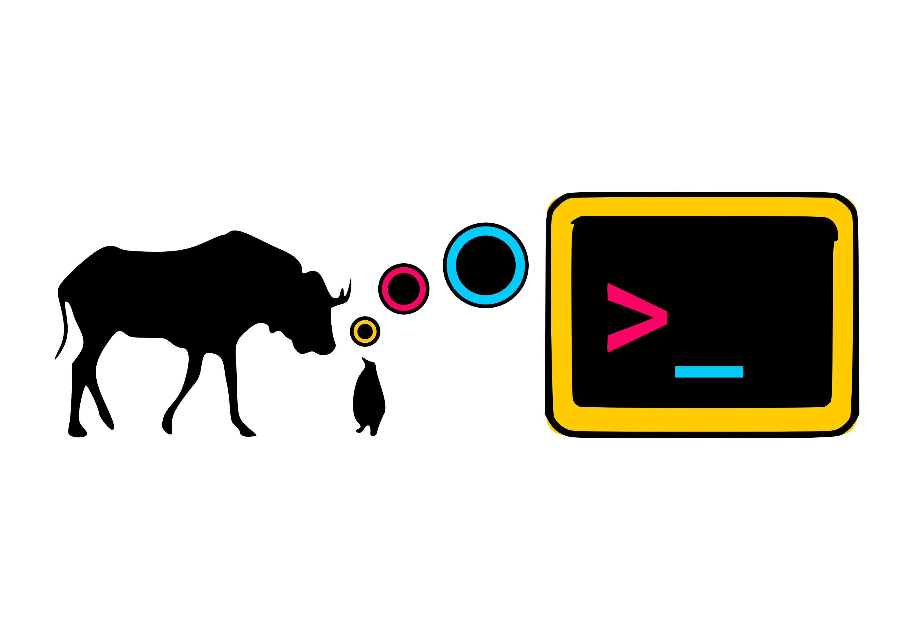

# Le logiciel libre est encore plus essentiel maintenant

***Richard Stallman***

Une version profondément remaniée de cet article a été publiée dans Wired
[^1].

Cela fait maintenant 30 ans que j’ai lancé le mouvement du logiciel
libre, qui milite pour que le logiciel respecte la liberté de
l'utilisateur et la communauté. Nous qualifions ce logiciel de « libre »
(nous utilisons ce mot, même en anglais, dans l'expression free/libre,
pour souligner le fait que nous parlons de liberté et non de prix).
Certains programmes privateurs, tels que Photoshop, sont vraiment
coûteux; d'autres, tels que Flash Player, sont disponibles
gratuitement. Dans les deux cas, ils soumettent leurs utilisateurs au
pouvoir du propriétaire du programme.

Beaucoup de choses ont changé depuis le début: dans les pays
développés, la plupart des gens possèdent maintenant des ordinateurs
(parfois appelés « téléphones ») et s'en servent pour se connecter à
Internet. Si les logiciels non libres continuent de forcer les
utilisateurs à abandonner à un tiers le pouvoir sur leur informatique,
il existe à présent un autre moyen de perdre ce pouvoir: le « service
se substituant au logiciel » ou SaaSS, qui consiste à laisser le serveur
d’un tiers prendre en charge vos tâches informatiques.

Tant les logiciels non libres que le SaaSS peuvent espionner
l'utilisateur, enchaîner l'utilisateur et même attaquer l'utilisateur.
Les abus sont monnaie courante dans les services et logiciels privateurs
parce que les utilisateurs n'en sont responsables. C'est là que se situe
la différence fondamentale: les logiciels non libres et le SaaSS sont
contrôlés par une entité externe (généralement une société privée ou un
État), et les utilisateurs n'ont pas leur mot à dire. Le logiciel libre,
au contraire, met l'utilisateur aux commandes.

Pourquoi ce contrôle est-il important? Parce qu'avoir la liberté
signifie avoir la maîtrise de sa propre vie. Si vous utilisez un
programme pour mener à bien des tâches affectant votre vie, votre
liberté dépend du contrôle que vous avez sur ce programme. Vous méritez
d'avoir un contrôle sur les programmes que vous utilisez, d'autant plus
quand vous les utilisez pour quelque chose d'important pour vous.

Pour que l'utilisateur ait la maîtrise du programme, il doit bénéficier des
quatre libertés essentielles [^2].

0. La liberté de faire fonctionner le programme comme l'on souhaite,
pour n'importe quel usage.

1. La liberté d'étudier le « code source » du programme, et de le
modifier, de telle sorte que le programme s'exécute comme vous le
voulez. Les programmes sont écrits par des programmeurs dans un langage
de programmation, ressemblant à de l'anglais combiné avec de l'algèbre;
cette forme du programme est le « code source ». Toute personne
connaissant la programmation, et ayant le programme sous forme de code
source, peut le lire, comprendre son fonctionnement, et aussi le
modifier. Quand tout ce que vous avez est la forme exécutable, une série
de nombres qui est optimisée pour faire fonctionner l'ordinateur mais
extrêmement difficile à comprendre pour un être humain, la compréhension
et la modification du programme sous cette forme sont d'une difficulté
redoutable.

2. La liberté de créer et de distribuer des copies exactes quand vous
le souhaitez. (Ce n'est pas une obligation; c'est votre choix. Si le
programme est libre, cela ne signifie pas que quelqu'un a l'obligation
de vous en proposer une copie, ou que vous avez l'obligation de lui en
proposer une copie. Distribuer un programme à des utilisateurs sans
liberté, c'est leur faire du tort; cependant, choisir de ne pas
distribuer le programme — en l'utilisant de manière privée — ne fait de
tort à personne.)

3. La liberté de faire et de distribuer des copies de vos versions
modifiées, quand vous le souhaitez.

Avec les deux premières libertés, chaque utilisateur peut exercer un
contrôle individuel sur le programme. Avec les deux autres libertés,
n'importe quel groupe rassemblant des utilisateurs peut exercer un
*contrôle collectif* sur le programme; avec l'ensemble de ces quatre
libertés, les utilisateurs ont la pleine maîtrise du programme Si l'une
d'elle fait défaut ou est inadéquate, le programme est privateur (non
libre) et injuste.

D’autres types d’œuvres sont exploitées pour accomplir des tâches
pratiques; parmi celles-ci, les recettes de cuisine, les matériels
didactiques tels les manuels, les ouvrages de référence tels les
dictionnaires et les encyclopédies, les polices de caractère pour
l’affichage de texte mis en forme, les schémas électriques pour le
matériel à faire soi-même, et les patrons pour fabriquer des objets
utiles (et pas uniquement décoratifs) à l’aide d’une imprimante 3D. Il
ne s’agit pas de logiciels et le mouvement du logiciel libre ne les
couvre donc pas au sens strict. Mais le même raisonnement s’applique et
conduit aux mêmes conclusions: il faut que ces œuvres soient
distribuées avec les quatre libertés.

Un programme libre vous permet de le bricoler pour lui faire faire ce
que vous voulez (ou cesser de faire quelque chose qui vous déplaît).
L'idée de bricoler le logiciel doit vous paraître ridicule si vous avez
l'habitude des boîtes noires du logiciel privateur, mais dans le monde
du Libre c'est courant, et c'est une bonne façon d'apprendre à
programmer. Même le passe-temps traditionnel des Américains, bricoler
les voitures, est entravé parce que les voitures contiennent maintenant
du logiciel non libre.

## L'injustice du privateur

Si les utilisateurs ne contrôlent pas le programme, le programme
contrôle les utilisateurs. Avec le logiciel privateur, il y a toujours
une entité, le « propriétaire » du programme, qui en a le contrôle et
qui exerce, par ce biais, un pouvoir sur les utilisateurs. Un programme
non libre est un joug, un instrument de pouvoir injuste.

Dans des cas proprement scandaleux (devenus aujourd'hui tout à fait
habituels), les programmes privateurs sont conçus pour espionner les
utilisateurs, leur imposer des restrictions, les censurer et abuser d'eux
[^3]. Le système d'exploitation des iTrucs d'Apple, par exemple, fait tout
cela, et Windows également, sur les appareils mobiles équipés de puces ARM.
Windows, le micrologiciel des téléphones mobiles et Google Chrome pour Windows
comportent chacun une porte dérobée universelle permettant à une certaine
entreprise de modifier le programme à distance sans requérir de permission. Le
Kindle d'Amazon a une porte dérobée qui peut effacer des livres.

Pour en finir avec l'injustice des programmes non libres, le mouvement du
logiciel libre développe des logiciels libres qui donnent aux utilisateurs la
possibilité de se libérer eux-mêmes. Nous avons commencé en 1984 par le
développement du système d'exploitation libre GNU [^4]. Aujourd'hui, des
millions d'ordinateurs tournent sous GNU, principalement sous la combinaison
GNU/Linux [^5].

Distribuer un programme aux utilisateurs sans la liberté fait du tort à
ces utilisateurs; cependant, choisir de ne pas distribuer le programme
ne fait de tort à personne. Si vous écrivez un programme et que vous
l'utilisez en privé, cela ne fait pas de mal aux autres (il est vrai que
vous perdez une occasion de faire le bien, mais ce n'est pas la même
chose que de faire le mal). Ainsi, quand nous disons que le logiciel
doit être libre, cela veut dire que chaque exemplaire doit comporter les
quatre libertés, mais cela ne veut pas dire que quelqu'un a l'obligation
de vous en proposer un exemplaire.

## Logiciel non libre et SaaSS

Le logiciel non libre a été le premier moyen, pour les entreprises, de
prendre la main sur l'informatique des gens. De nos jours, il existe un
autre moyen, appelé « service se substituant au logiciel », ou SaaSS.
Cela équivaut à laisser quelqu'un d'autre effectuer vos propres tâches
informatiques.

Le recours à un SaaSS n'implique pas que les programmes exécutés sur le
serveur soient non libres (même si c'est souvent le cas) . Mais
l'utilisation d'un SaaSS et celle d'un programme non libre produisent
les mêmes injustices: ce sont deux voies différentes qui mènent à la
même situation indésirable. Prenez l'exemple d'un service de traduction
SaaSS: l'utilisateur envoie un texte au serveur; celui-traduit le
texte (disons, de l'anglais vers l'espagnol) et renvoie la traduction à
l'utilisateur. La tâche de traduction est alors sous le contrôle de
l'opérateur du serveur et non plus de l'utilisateur.

Si vous utilisez un SaaSS, l'opérateur du serveur contrôle votre
informatique. Cela nécessite de confier toutes les données concernées à
cet opérateur, qui sera à son tour obligé de les fournir à l'État. Qui
ce serveur sert-il réellement, en fin de compte? [^7].

## Injustices primaires et secondaires

Quand vous utilisez des logiciels privateurs ou des SaaSS, avant tout
vous vous faites du tort car vous donnez à autrui un pouvoir injuste sur
vous. Il est de votre propre intérêt de vous y soustraire. Vous faites
aussi du tort aux autres si vous faites la promesse de ne pas partager.
C'est mal de tenir une telle promesse, et c'est un moindre mal de la
rompre; pour être vraiment honnête, vous ne devriez pas faire du tout
cette promesse.

Il y a des cas où l'utilisation de logiciel non libre exerce une
pression directe sur les autres pour qu'ils agissent de même. Skype en
est un exemple évident: quand une personne utilise le logiciel client
non libre Skype, cela nécessite qu'une autre personne utilise ce
logiciel également — et par là même que toutes deux abandonnent leur
liberté (les Hangouts de Google posent le même problème). La simple
suggestion d'utiliser de tels programmes est mauvaise. Nous devons
refuser de les utiliser, même brièvement, même sur l'ordinateur de
quelqu'un d'autre.

Un autre dommage causé par l'utilisation de programmes non libres ou de
SaaSS est que cela récompense son coupable auteur et encourage le
développement du programme ou « service » concerné, ce qui conduit à
leur tour d'autres personnes à tomber sous la coupe de l'entreprise de
développement.

Toutes les formes de dommage indirect sont amplifiées lorsque
l’utilisateur est une institution publique ou une école.

## Logiciel libre et État

Les services publics existent pour les citoyens, et non pour eux-mêmes.
Lorsqu’ils utilisent l’informatique, ils le font pour les citoyens. Ils
ont le devoir de garder un contrôle total sur leurs tâches
informatiques, afin de garantir leur bonne exécution au bénéfice des
citoyens (cela constitue la souveraineté informatique de l'État). Ils ne
doivent jamais laisser ce contrôle tomber entre les mains du privé.

Pour garder la maîtrise des tâches informatiques qu'ils effectuent au
nom des citoyens, les agences et services publiques ne doivent pas
utiliser de logiciel privateur (logiciel qui est sous le contrôle d'une
entité autre que l'État). Ils ne doivent pas non plus les confier à un
service programmé et géré par une entité autre que l'État, puisque ce
serait un SaaSS.

Il y a un cas crucial dans lequel un logiciel privateur n'est absolument pas
sécurisé: une attaque venant de son développeur. Et le développeur peut en
aider d'autres à attaquer. [Microsoft montre les bogues de Windows à la NSA
(l'agence gouvernementale américaine d'espionnage numérique) [^7] avant de les
corriger. Nous ne savons pas si Apple fait de même, mais elle est soumise à la
même pression du gouvernement que Microsoft. Si le gouvernement d'un autre
pays utilise un tel logiciel, il compromet la sécurité nationale. Voulez-vous
que la NSA pénètre par effraction dans les ordinateurs de votre gouvernement?
Lisez nos suggestions pour une politique de promotion du logiciel libre au
niveau du gouvernement [^8].

## Logiciel libre et éducation

Les écoles (et ceci inclut toutes les activités éducatives) influencent
le futur de la société par l’intermédiaire de leur enseignement. Elles
doivent enseigner exclusivement le logiciel libre, afin de mettre leur
influence au service du bien public. Enseigner l’utilisation d’un
programme non libre, c’est implanter la dépendance à l’égard de son
propriétaire, en contradiction avec la mission sociale de l’école. En
dispensant une formation à l'usage du logiciel libre, les écoles
orienteront l'avenir de la société vers la liberté, et aideront les
programmeurs talentueux à maîtriser leur art.

En outre, elles enseigneront à leurs étudiants l'habitude de coopérer,
d'aider les autres. Chaque classe doit avoir la règle suivante: «
Élèves et étudiants, cette classe est un endroit où nous partageons nos
connaissances. Si vous apportez des logiciels, ne les gardez pas pour
vous. Au contraire, vous devez en partager des copies avec le reste de
la classe, de même que le code source du programme au cas où quelqu’un
voudrait s’instruire. En conséquence, apporter des logiciels privateurs
en classe n’est pas autorisé, sauf pour les exercices de
rétroingénierie. »

Pour les développeurs de logiciels privateurs, nous devrions punir les
étudiants assez généreux pour partager leurs logiciels ou assez curieux pour
chercher à les modifier. Ce serait faire de la mauvaise éducation.  Voir dans
« Free Software and Education » une discussion plus poussée de l'usage des
logiciels libres à l'école.

## Le logiciel libre: plus que des « avantages »

On me demande souvent de décrire les « avantages » du logiciel libre.
Mais le mot « avantages » est trop faible quand il s’agit de liberté. La
vie sans liberté est une oppression, et cela s’applique à l’informatique
comme à toute autre activité de nos vies quotidiennes. Nous devons
refuser de donner aux propriétaires des programmes ou des services qui
s'y substituent la maîtrise de nos tâches informatiques. Il faut le
faire pour des raisons égoïstes; mais pas seulement pour des raisons
égoïstes.

L'une des libertés est celle de coopérer avec les autres. En empêchant
les gens de coopérer, on les maintient dans la division, point de départ
d'une machination ayant pour but de les opprimer. Dans la communauté du
logiciel libre, nous avons pleinement conscience de l'importance de la
liberté de coopérer, parce que notre travail consiste en une coopération
organisée. Si votre ami vient chez vous et vous voit utiliser un
programme, il se peut qu'il vous en demande une copie. Un programme qui
vous empêche de le redistribuer, ou dit que « vous n'êtes pas censé le
faire », est antisocial.

En informatique, coopérer veut dire redistribuer des copies exactes d'un
programme à d'autres utilisateurs. Cela veut aussi dire leur distribuer vos
modifications. Le logiciel libre encourage ces formes de coopération, alors
que le logiciel propriétaire les interdit. Il interdit la redistribution de
copies, et en refusant le code source aux utilisateurs, il les empêche de le
modifier. Le SaaSS a le même résultat: si vous faites une tâche informatique
sur le web, dans le serveur de quelqu'un d'autre, au moyen d'une copie de
programme qui appartient à quelqu'un d'autre, vous ne pouvez ni voir ni
toucher le logiciel qui fait cette tâche, donc vous ne pouvez ni le distribuer
ni le modifier.

## Conclusion

Nous méritons de contrôler notre propre informatique. Comment y arriver? En
refusant les logiciels privateurs sur les ordinateurs que nous possédons ou
utilisons au quotidien, et en rejetant les SaaSS; en développant des logiciels
libres (pour ceux d’entre nous qui sont programmeurs) [^10]; en artageant ces
idées avec les autres [^11].

Nous le faisons depuis 1984, ainsi que des milliers d'utilisateurs; c'est
pourquoi nous disposons maintenant du système d'exploitation libre GNU/Linux
que chacun, programmeur ou non, peut utiliser. Rejoignez notre cause, comme
programmeur ou activiste. Rendons la liberté à tous les utilisateurs
d'ordinateurs.

------------------------------------------------------------------------

**Richard Matthew Stallman:** Développeur et militant nord-américain des
logiciels libres. Il défend une distribution des logiciels qui permette
à l'utilisateur non seulement d'accéder à leur liberté d'utilisation
mais aussi de les étudier, de les distribuer et également de les
modifier. Il est à l’origine du projet GNU et de la licence publique
générale GNU connue aussi sous l’acronyme GPL. Il a popularisé le terme
anglais « copyleft ». Programmeur renommé de la communauté informatique
américaine et internationale, il a développé de nombreux logiciels dont
les plus connus des développeurs sont l’éditeur de texte GNU Emacs, le
compilateur C de GNU, le débogueur GNU mais aussi, en collaboration avec
Roland McGrath, le moteur de production GNU Make.

------------------------------------------------------------------------

Traduction: Framalang (Asta, ckiw, Penguin, Amine Brikci-N, lgodard,
Feadurn, Thérèse, aKa, Spanti Nicola, Paul, Scailyna, Armos, genma,
Figue, Sébastien et quelques anonymes).

Révision: trad-gnu [at] april [dot] org

[^1]: http://www.wired.com/opinion/2013/09/why-free-software-is-more-important-now-than-ever-before

[^2]: https://www.gnu.org/philosophy/free-sw.fr.html

[^3]: https://www.gnu.org/philosophy/proprietary.fr.html

[^4]: https://www.gnu.org/gnu/the-gnu-project.fr.html

[^5]: https://www.gnu.org/gnu/gnu-linux-faq.fr.html

[^6]: https://www.gnu.org/philosophy/who-does-that-server-really-serve.fr.html

[^7]: http://arstechnica.com/security/2013/06/nsa-gets-early-access-to-zero-day-data-from-microsoft-others/

[^8]: https://www.gnu.org/philosophy/government-free-software.fr.html

[^9]: https://www.gnu.org/education/

[^10]: https://www.gnu.org/licenses/license-recommendations.fr.html

[^11]: https://www.gnu.org/help
