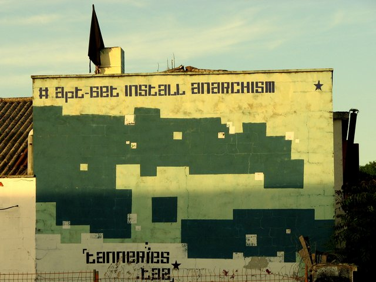
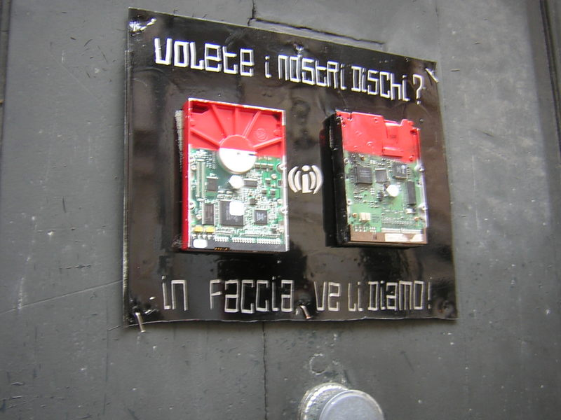

# Hacklabs and Hackerspaces

## Shared machine workshops

***Maxigas***

## Definitions

Can you imagine professional and would-be engineers building their own
Disneyland? It happens in most European capitals.  Hacklabs [^1] and
hackerspaces [^2] are shared machine workshops run by hackers for
hackers. They are dedicated rooms or buildings where people interested in
technologies can come together to socialise, create and share knowledge, and
work on projects individually or in groups. There are also regular hacker
gatherings which complement the fixed space with a fixed time to meet. Thus a
shared space and time of discourse is constructed, where meanings are
negotiated and circulated, establishing what can be called a scene.

Hacklabs and hackerspaces belong to a diverse and troubled family taxonomy of
shared machine workshops. Tech shops, co-working spaces, incubators,
innovation- and medialabs, various kinds of hubs, and finally fablabs and
makerspaces – listed here in order of co-optation – all try to emulate and
capitalise on the techocultural force galvanised by hacklabs and
hackerspaces. Explicit references on the websites of such organisations to the
concept of “community” [^3] quickly betray them as lacking the very values
they advertise. After all, contemporary capitalism is increasingly dependent
on authenticity and coolness, which it mines from the underground. [^4]

Regarding the differences between hackers and makers, lines are not
clear. Some hackerspace members state that hackers are not just making, but
also breaking things, while a makerspace member complained that “hackers never
finish anything”. [^5] In marketing materials, discoursive strategies vary in
ways to maneuver around the four letter word (“HACK”) in order to tame its
negative implications but gain the positive associations it brings. While the
hacker ethos is often held up as a central system of values which permeates
the scene, it may be more useful to understand it not as an a priori moral
ground. Instead, as a practice based orientation which stems from the social
context and social history in which hacklabs and hackerspaces are embedded:
the way they “sit” in the social fabric. As such it varies widely with the
context, as we shall presently see.

Therefore, the following section briefly traces the historical trajectories of
both hacklabs and hackerspaces, including their intersections. It should be
noted that the current configurations presented below are not the only
possible way they can or did work.  Next, the potentials and social
significance of currently established hacklabs and hackerspaces is explored,
preparing the ground for the evaluation of these tactics from a
strategico-political point of view in the last section.

## Historical trajectory

The stories and histories below are confined to Europe, since I am more
familiar with the continent.

Figure 1: Les Tanneries squatted social centre, Dijon, 2007. Photo published by nigra. Source: https://linksunten.indymedia.org/de/node/98266 Licence: Creative Commons 2.0 Attribution Non-commercial Share-alike.

### Hacklabs

Hacklabs existed basically since the advent of the personal computer, [^6] but
their “golden age” has been the decade around the turn of the millenium
(greatly inspired by the conclusions of the Hackmeeting in Milano, 1999)
[^7]. Often located in squatted spaces and occupied social centres, they were
part and parcel of the autonomous politics toolbox, on par with such practices
as food not bombs popular vegan kitchens, anarchist infoshops and libraries,
free shops and punk concert halls [^8]. For instance, the Les Tanneries
occupied social centre in Dijon (see Fig.1) housed all these activities under
one roof at some point, [^9] as did the RampART in London, [^10] the Rimaia in
Barcelona, [^11] or Forte Prenestino in Rome [^12]. The largest network of
hacklabs existed in Italy, [^13] where influential hacklabs bloomed from the
LOA hacklab in the populous North (Milan) [^14], through the aforementioned
Forte and bugslab [^15], also in Rome, to Freaknet [^16], known to be the
first of its kind, in Catania, Sicily.

A division in the sensibilities of participants and the focus of activities
can also be discerned, with North European hacklabs leaning towards security
and circumvention and South European ones more bent on media production. [^17]
For instance, the German Chaos Computer Club is known to break various
important state and corporate systems publicly since 1985 (Bildschirmtext bank
transactions) [^18] until now (Biometric passports) [^19], while Dutch mag
Hack-Tic had to close down in 1993 for publishing exploits – at the same time,
Barcelona hacklab Riereta [^20] was famous for their ground breaking work in
live streaming, while the Dyne “Free Culture Foundry” [^21] for its work in
(real time) multimedia processing and multimedia operating systems (Dynebolic
Live CD) [^22].  Today, notable examples exist in Amsterdam (LAG) [^23] and
near Barcelona (Hackafou) [^24]. Both operate in the context of larger
autonomous spaces: the Binnenpret [^25] in Amsterdam where LAG is located is a
legalised (ex-squat) building complex which houses an anarchist library, the
OCCI self-managed musical venue, a vegan restaurant and the Revolutions Per
Minute record label, amongst other things like apartments; while Calafou [^26]
where Hackafou is, calls itself an ecoindustrial, postcapitalist colony based
on a cooperativist model, including a furniture manufactory, poultry farming,
the TransHackFeminist Hardlab Pechblenda [^27] as well as flats.

Figure 2: Old hard drives nailed to the front door of the police station in
Dijon, France. Action against the censorship of the local Independent Media
Center. 4 November, 2004. Photo published by print. Source:
http://print.squat.net/move.html

Around the turn of the millenium, when modem connections were considered
modern, it was sometimes only possible to connect to the Internet (or its
predecessors, like BBSs and networks like FidoNet) by getting down to a
hacklab in your neighborhood. Therefore, these “squatted Internet workspaces”
– as they were sometimes called in the North of Europe – did not only
facilitate virtual connections between people and machines but also
contributed to the formation of embodied counter-computing
communities. Personal computers were still scarce, so “\[m\]embers of the
collective scavenged and rebuilt computers from trash”. [^28] Obsolete
computers and discarded hardware would often find its way to hacklabs, and
transformed into useful resources — or failing that, to artworks or political
statements (Fig.2). Mobile phones and popular voice-over-IP solutions like
Skype did not exist when hackers from WH2001 (Wau Holland 2001), Madrid and
bugslab, Rome set up telephone booths on the street where immigrants could
call home for free. GNU/Linux development did not yet achieve a critical mass
so installing an open source operating system was an art or a craft, not a
routine operation. Free software was not yet established as a lucrative
segment of the market, but had some characteristics of a movement, and
hacklabs housed many developers.  Hacklabs seemlessly combined three
functions: providing a social and workspace for underground technology
enthusiasts to learn and experiment; supporting and participating in social
movements; and providing open access to information and communication
technologies for the public. In cyberspace, everything was still fluid and
there was an overwhelming intuition, paradoxically inspired by cyberpunk
literature, that if the losers of history learn fast enough, they can outflank
“the system”. Evidently, hacklabs were political projects which appropriated
technology as part of the larger scheme of the autonomous movement to
transform and self-organise all parts of life. Therefore, technological
sovereignity is interpreted here as the sovereignity of the autonomous social
movements, as a technology out of the control of state and capital.

### Hackerspaces

Hackerspaces were brought in by a transversal current, related to the advent
of physical computing [^29]: the idea that you can program, control, and
communicate with things outside the computer, and the ability to do so given
the availability of microcontrollers in general on the consumer market,
together with the beginnings of open source software/hardware platforms like
the Arduino in particular on the hobbyist market. Arduinos leveraged the power
of microcontrollers to bring physical computing within the reach of even
novice programmers who did not specialise in machine control. The idea of
physical computing was inspiring in the post-dotcom-bubble era, when the
increasing concentration of Internet based services in the hands of a few
major US based multinational corporations like Google, Facebook and Amazon
made web development, interaction design and network engineering both
ubiquitous and utterly boring.10

The subsequent range of technologies, including 3D printers, laser cutters,
CNC machines (all digital fabrication tools), and quadrocopters (the hacker
version of drones), DNA synthesisers, software-defined radios – were all built
on the extended knowledge and availability of microcontrollers. It is not
far-fetched to argue that every few years hackerspaces absorb a major
technology from the military-industrial complex, and come up with a DIY-punk
version to be reintegrated into post-industrial capitalism.

As opposed to hacklabs, hackerspaces interface with the modern institutional
grid through legal entities (associations or foundations), and rent spaces
[^30] financed through a club-like membership model. Their social basis is
comprised of independent minded technology professionals who like to explore
technologies generally without the confines of the market, and whose level of
knowledge and generous paychecks allow them to articulate the relative
autonomy of their class in such collective initiatives. Such a constellation
allows the assorted freaks, anarchists, unemployed con (“media”) artists and
so on to tag along with them.

It is worth to remember Bifo’s testimony comparing his experience in
organising the industrial working class in the 1970s and his contemporary
activism organising precarious artists. [^31] The main difference he refers in
practical terms is the difficulty of finding a shared time and space where and
when collective experiences and subject formation can take place. Hackerspaces
address both issues rather effectively, combining 24 hour access and the
membership model with their own brand of social technologies for coordination.

From the point of view of the engagement of civil society with hacklabs and
hackerspaces, it is crucial to understand how the productive processes are
carried out in these social contexts. Participants are driven by a curiosity
about technology and the desire for creation. They are passionate about
understanding technology and building their own creations from the available
components, let it be communication protocols, functional or disfunctional
technological artifacts, techno-garbage or raw materials like wood and
steel. This often necessitates a degree of reverse engineering: opening up,
taking apart, and documenting how something works; and then putting it
together in a different way, or combining it with other systems – altering its
functionality in the process. Such reinvention is often understood as hacking.

Tinkering and rapid prototyping are two other concepts which are used to
theorise hacker activity. The former emphasises the incremental and
exploratory aspect of how hackers work, as well as the contrast with planned
industrial design projects, and ideals of the scientific method as a top-down
process departing from general principles and moving towards problems of the
concrete technological implementation. The latter foregrounds the dynamics of
such work, where the accent often falls on producing interesting results
rather than understanding clearly all what is involved, or maintaining full
control over the development environment. Those who seek to exploit hackers
under the guise of collaboration often forget that, resulting in mutual
frustrations.  Indeed, calling something a hack can refer to the fact that it
is really crudely put together to be handy in a particular situation, without
much consideration or knowledge – or the opposite: that it is a work of
genius, solving a complex and often general problem with striking simplicity
and robustness.

The politics of hackerspaces is similarly ambiguous: opposite to hacklabs,
where technology is more or less subordinated to political perspectives, in
the hackerspaces politics is most often framed by technology
[^32]. Participants of the latter often feel deeply about issues like freedom
of information, privacy and security, or measures (be they legal or
technological) which restrict technological experimentation, such as patents
and copyright, because these issues touch upon their own conditions of
self-expression [^33]. For the same reason, traditional social struggles like
the redistribution of power and wealth, or structural opression based on the
perception of bodies like gender and race leave many of them untouched. While
they tend to frame their claims and demands in universalistic terms, or in the
language of pure efficiency, [^34] they fail to exercise solidarity with other
social groups.

In particular, while standing up firmly for the idea of user controlled
technology, their universalistic ideal often boils down to “engineer
controlled technologies” in practice. Hackerspaces may be lacking the
motivations or the tools to build a sociologically concrete political subject
wider than their own ranks. Fortunately, their most important interests
overlap with those of more exploited and oppressed social groups, so that the
deficiencies of their political perspectives can only be detected at its blind
spots. An even more hopeful sign is that last years saw an increasing
diversification of the hackerspace audience. Inspired by the makerspaces, many
hackerspaces started to organise outreach activities for children [^35], while
new spaces with a gender focus has been founded, as a result of the
dissatisfaction with inclusivity in mainstream hackerspaces. [^36]

## Potentials and limitations

Hackerspaces arguably fall outside the grid of modern institutions, since they
are not affiliated with the state, do not have ambitions to participate in the
market with aim of capital accumulation, and – with some exceptions – lack the
ambitions associated with civil society, like speaking in the name of other
actors, mobilising the population, or pressuring the state institutions. Of
course, in each country they position themselves somewhat differently: while
in Germany the Chaos Computer Club which is associated with many local
hackerspaces [^37] is a consultative body of the Constitutional Court of
Germany, a position of professionalism, hackerspaces in the Netherlands [^38]
blend into the alternative landscape between artist workshops and small
startups.

At the same time, relative autonomy does not simply imply an outsider
position, it does also point to a degree of internal organisation.
Hackerspaces are propelled by the hacker culture which is as old as personal
computers: at least according to some, it was the struggles of hackers, often
verging on illegality, which spawned the personal computer [^39]. Hackerspaces
are littered with old computers and networking hardware, to the extend that at
Hack42 [^40], (in Arnhem, The Netherlands), sports a full scale computing
history museum ranging from typewriters through the legendary PDP-11 from the
1970s to contemporary models.

Finally, autonomy is relative because it does not achieve or aim at complete
independence and self-sufficiency, or one could say sovereignity, from the
state. This is in stark contrast with hacklabs, which usually operate without
a legal body and inhabit autonomous zones of some kind. So while hacklab
members can hide effectively behind pseudonymous monikers without further
questioning, hackerspace members can call each others names, but in most
countries they have to give their real name and address to become members.

So while hacklabs oppose the state ideologically and heads-on in an anarchist
way, hackerspaces question state legitimacy in playful ways. [^41] can work on
the level of immanence, either by simply applying the right repertoire of
existing technologies to the right situation (creating a website for a good
cause, or rendering it disfunctional) or developing existing or new tools,
like porting a 3D printer driver from Windows to GNU/Linux operating system,
or inventing a universal remote with a single button to turn off any TV. [^42]

## Strategic outlook

While hacklabs operated with a clear political mission based on a more or less
well articulated political ideology, hackerspaces explicitly deny their
political engagement. These strategies have their own potentials and
pitfalls. On the one hand, the hacklabs of old would directly engage in social
conflicts, bringing their technological expertise to the struggle – and yet
they remained enclosed in what is colloquially called the activist
ghetto. While helping to gain an edge and access the once widespead
infrastructure of the autonomous movement, their alignment severely limited
their social reach as well as their proliferation. On the other hand,
hackerspaces can and do mobilise their own resources based on the relative
affluence of their members and the close connections with industry which comes
with the same, while being able to reach a wider audience and collaborate with
social formations across the full spectrum of society. Their increasing
numbers (over 2000+ registered on hackerspaces.org), far outgrowing that of
hacklabs even in their heyday, are in no doubt at least partly thanks to these
factors of apolitical affluence. Hackerspaces stepped beyond the historical
limits of hacklabs, yet they lost on political consistency in the process.

Declaration of political neutrality should always be regarded questioningly,
however. Most hackerspace members agree that “technology is not neutral”, or
that it is the “continuation of politics by other means”: the questioning of
technological rationality, as well as the oppressive essence of technology, is
common parlance in in conversations, even if hackerspaces would not embroider
the slogan on their flags. In the final analysis, however, the main
contribution of both hacklabs and hackerspaces to radical political
transformation is their tireless work on establishing user control over
technologies, and expanding the range of these technologies year by year, from
software to hardware to biology. What is needed for hackerspaces, is to
systematically raise consciousness on the significance of these practices and
the solidities they imply.

------------------------------------------------------------------------

**Maxigas:** Étudiant en littérature, cinématographie et philosophie avant de
devenir spécialiste en sciences sociales dans le domaine des études
scientifiques et technologiques. Il vit sa vie comme un fauteur de troubles,
journaliste militant, défenseur radical du sysadmin et grand amateur de la
culture cybernétique. Actuellement, il mène des recherches sur les artefacts
et architectures non abouties des hackerspaces en tant que doctorant à
UOC/IN3. Maxigas travaille également sur une recherche visant à construire un
ordinateur biologique au sein du Biolab de Calafou.  Web:
http://research.metatron.ai/

------------------------------------------------------------------------

Il n'a pas été possible de traduire cet article, nous le publions en sa
version originale en anglais. Si vous voulez traduire cet article en français
veuillez contacter l'auteur'.

------------------------------------------------------------------------

[^1]: http://web.archive.org/web/20130613010145/http://hacklabs.org/

[^2]: http://hackerspaces.org/

[^3]: http://techshops.ws/

[^4]: Liu, Alan. 2004. The Laws of Cool.  Chicago, IL: University of Chicago Press. Fleming, Peter. 2009.  Authenticity and the Cultural Politics of Work: New Forms of Informal Control. Oxford: Oxford University Press.

[^5]: I heard this verbatim quote from Debora Lanzeni.

[^6]: Halleck, Dee Dee. 1998. “The Grassroots Media of Paper Tiger Television and the Deep Dish Satellite Network.” Crash Media (2).

[^7]: http://www.hackmeeting.org/hackit99/

[^8]: Maxigas. 2012. “Hacklabs and Hackerspaces — Tracing Two Genealogies.” Journal of Peer Production 2. http://peerproduction.net/issues/issue-2/peer-reviewed-papers/hacklabs-and-hackerspaces/

[^9]: http://tanneries.squat.net/

[^10]: http://therampart.wordpress.com/

[^11]: https://n-1.cc/g/universitat-lliure-larimaia and http://web.archive.org/web/20130313184945/http://unilliurelarimaia.org/

[^12]: http://www.forteprenestino.net/

[^13]: Link collection by Austistici/Inventati: http://www.autistici.org/hacklab/

[^14]: http://www.autistici.org/loa/web/main.html

[^15]: http://www.autistici.org/bugslab/

[^16]: http://www.freaknet.org/

[^17]: Insight from groente.

[^18]: http://www.textfiles.com/news/boh-20f8.txt

[^19]: http://archive.is/Blfd

[^20]: http://web.archive.org/web/20121016060835/http://www.riereta.org/wp/

[^21]: http://dyne.org/

[^22]: http://www.dynebolic.org/

[^23]: http://laglab.org/

[^24]: https://calafou.org/en/proyectos/hackafou

[^25]: http://binnenpr.home.xs4all.nl/

[^26]: http://calafou.org/

[^27]: http://pechblenda.hotglue.me/

[^28]: Wikipedia_contributors. 2014.  “Wikipedia, The Free Encyclopedia: ASCII (squat).”  http://en.wikipedia.org/w/index.php?title=ASCII_(squat)&oldid=540947021 .

[^29]: Igoe, Tom, and Dan O’Sullivan. 2004. Physical Computing: Sensing and Controlling the Physical World with Computers. London: Premier Press.

[^30]: In the Netherlands some hackerspaces rent “antisquat” real estate which comes with a low price and a disfavourable contract, a scheme initially established by rentier companies to fend off squatters from the property.

[^31]: Franco Berardi a.k.a. Bifo. 2009.  Franco Berardi and Marco Jacquemet and Gianfranco Vitali. New York: Autonomedia.

[^32]: Maxigas. “Hacklabs and Hackerspaces: Framing Technology and Politics.” Presentation IAMCR (International Association of Media and Communication Researchers, annual conference), Dublin..  http://www.iamcr2013dublin.org/content/hacklabs-and-hackerspaces-framing-technology-and-politics .

[^33]: Kelty, Christopher M. 2008. Two Bits: The Cultural Significance of Free Software. Durham, NC: Duke University Press. http://twobits.net/

[^34]: Söderberg, Johan. 2013.  “Determining Social Change: The Role of Technological Determinism in the Collective Action Framing of Hackers.” New Media & Society 15 (8) (January): 1277–1293. http://nms.sagepub.com/content/15/8/1277

[^35]: Becha. 2012. “Hackerspaces Exchange.”  https://events.ccc.de/congress/2012/wiki/Hackerspaces_exchange

[^36]: Toupin, Sophie. 2013. “Feminist Hackerspaces as Safer Spaces?” .dpi: Feminist Journal of Art and Digital Culture (27).  http://dpi.studioxx.org/en/feminist-hackerspaces-safer-spaces

[^37]: Like the c-base hackerspace in Berlin, muCCC hackerspace in Munich, or CCC Mainz. http://c-base.org/ , http://muccc.org/events/ and http://www.cccmz.de/

[^38]: http://hackerspaces.nl/

[^39]: Levy, Steven. 1984. Hackers: Heroes of the Computer Revolution. Anchor Press, Doubleday.

[^40]: https://hack42.org/

[^41]: Some examples follow. The hackerspace passport is document where visitors to hackerspaces can collect stamps called “visas”. The Hackerspaces Global Space Program launched in 2011 with the mockup goal to “send a hacker to the moon in 23 years”. SpaceFED is a federated authentication system for (wireless) network access across hackerspaces analogous to eduroam which is used in higher education institutions worldwide.

[^42]: http://learn.adafruit.com/tv-b-gone-kit
