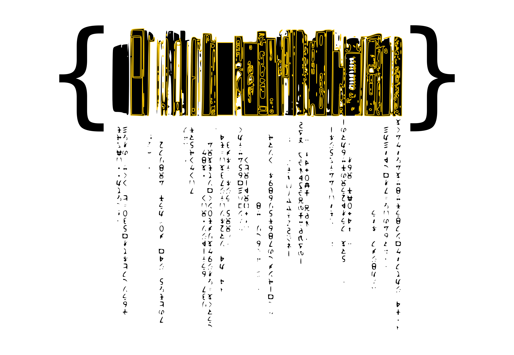

# Biblioteca Pubblica Digitale

*Marcell Mars*

Nel catalogo delle grandi innovazioni storiche, la biblioteca pubblica forma parte di uno dei fenomeni per i quali ci sentiamo piu' orgogliose, sicuramente assieme all'educazione e alla salute pubblica, la dichiarazione universale dei diritti dell'uomo, il metodo scientifico, Wikipedia e il software libero.

Si tratta di una di delle infrastrutture, quasi invisibili, che notiamo solo quando cominciano a scomparire.
Per molto tempo le biblioteche pubbliche sono state considerate come il posto dove accedere alla conoscenza, anche se dipendenti dai budget sempre instabili dello "stato di benessere" o dalle risorse di alcuni ricchi proprietari.

Internet ha capovolto il senso di quello che davamo per certo e per possibile. Il sogno di poter accedere tutte a tutta la conoscenza finalmente alla nostra portata. Sembrava solo una questione di diffusione. Saper intravedere quando le curve di distribuzione dei PC e l'accesso a Internet si univano per trasformare in realtá questo accesso universale alla conoscenza. 
Senza dubbio, invece, lo sviluppo delle biblioteche pubbliche nell'era di Internet sembra andare direttamente nella direzione opposta, facendo sí che possano facilmente sparire.

Molte biblioteche pubbliche non possono ricevere, e nemmeno comprare, i libri modificati da grandi case editrici[^1].
In alcuni casi, gli ebook che già fanno parte del loro catalogo devono essere distrutti dopo essere stati prestati un certo numero di volte[^2].  stiamo perdendo la battaglia del mercato, dominato da nuovi attori come Amazon, Google e Apple.

Peró la rivoluzione emancipatrice forma anche parte dei fenomeni per i quali possiamo mostrarci con orgoglio.
Dare potere alle persone affinché possano contare sui mezzi necessari per raggiungere i loro sogni.
Non possiamo rinunciare alle biblioteche pubbliche nell'era Internet, e tantomeno al sogno di un accesso universale a tutta la conoscenza umana. Per questo motivo attivisti, documentaristi, cittadine, artiste, hackers e molte altre persone in tutto il mondo, stanno creando le circostanze necessarie per trasformare questo sogno in realtà. Esattamente come dice Malvil Dewey: "scuole libere e biblioteche libere per ogni anima"[^3].

La proposta è la seguente: **facciamo un catalogo di tutti i libri che abbiamo scaricato e condividiamolo!**

Tanto alla fine una biblioteca pubblica consiste in:
 * un accesso libero per ogni membro della società;
 * alcuni cataloghi dei libri e documenti disponibili;
 * una persona "bibliotecaria".

Con i libri preparati per essere condivisi e meticolosamente categorizzati, chiunque puó diventare una "persona bibliotecaria".
Quando tutte le persone sono bibliotecarie, le biblioteche pubbliche si incontrano dappertutto, basterà solo guardandosi intorno.

La visione che sostiene la Memoria del mondo è che il patrimonio documentale mondiale appartiene a tutte le persone e dovrebbe essere integralmente preservato e protetto, partendo da un riconoscimento delle pratiche e dei costumi culturali e rimanendo completamente accessibile a tutte le persone senza porte d'entrata. Per questo gli obiettivi specifici sono:

* Facilitare la conservazione del patrimonio documentale mondiale attraverso l'uso delle tecniche piú appropriate come per esempio disseminare idee e informazioni, preparare training e workshop, essere disponibili a dare assistenza diretta, anche ponendo in relazione le persone e i collettivi con i progetti piú appropriati per loro.

* Dare supporto all'accesso universale al patrimonio documentale incrementando quindi la produzione delle copie digitali cosi come la compilazione dei cataloghi accessibili su Internet, fino alla pubblicazione e distribuzione di libri, cd, dvd e altri prodotti, in forma piu ampia e ugualitaria possibile.

* Tenere in conto le limitazioni esistenti proprie dei posti dove l'accesso ha implicazioni per coloro che lo custodiscono.
Le legislazioni e altre contingenze relative all'accessibilita degli archivi devono essere rispettate. Le sensibilità culturali, includendo la protezione delle comunita indigene e dei suoi archivi, devono essere rispettate.

* Aumentare la consapevolezza a livello mondiale dell'esistenza e dell'importanza del patrimonio documentale. Gli strumenti necessari alla sua esistenza partono dallo sviluppo di registri fino alla produzione degli strumenti e di pubblicazioni promozionali e di carattere informativo. La preservazione e l'accesso non solo si complementano, ma influenzano anche la presa di coscienza del valore del patrimonio documentale, dato che che piú accesso comporta piú necessità di preservare. Per questo la produzione di copie deve essere incoraggiata per ridurre la pressione e la preservazione di materiale unico.

**I temi che affiorano sono:**

* lo sviluppo delle infrastrutture collettive e autonome
* Prassi politiche sull'accesso e sulla creazione di conoscenza e documentazione
* cultura libera e istituzioni per i beni comuni
* Diversità culturale
* Disobbedienza civile
* Sovranità tecnologica

### Persone e Collettivi

Davvero molto poco sarebbe stato possibile se Sean Dockray non avesse cominciato [Aaaaarg](http://aaaaarg.org/), Dušan Barok [Monoskop](http://monoskop.org/), Sebastian Luetgert e Jan Gerber [Pirate Cinema](http://www.piratecinema.org/?page=faq) & [pad.ma](http://pad.ma) Kenneth Goldsmith [UbuWeb](http://ubu.com), Henry Warwick [Alexandria project](http://www.kether.com/bio),[Piratbyrån](http://en.wikipedia.org/wiki/Piratbyr%C3%A5n), [The Pirate Bay](http://thepiratebay.org) e se gli hackers dietro [Library Genesis](http://libgen.org) non avessero dato l'opportunita' di scaricare il loro catalogo di quasi un milioni di libri. Queste persone sono punti di riferimento per questo progetto e lavorare con loro su questi temi ci traforma in una cumunità amichevole. Vogliamo anche sottolineare che ci manca molto [Aaron Swartz](http://en.wikipedia.org/wiki/Aaron_Swartz).

### Biblioteca pubblica come modello di sviluppo

La Memoria del mondo si articola nelle seguenti proposte con il fine di ottenere un'infrastruttura distribuita di biblioteche pubbliche:

Sviluppare software per cataloghi [punto a punto](http://www.memoryoftheworld.org/es/blog/2012/11/26/catalogo-de-punto-a-punto) e per scambiare e condividere libri usando un [plugin p2p per calibre che si chiama let's share books](https://www.memoryoftheworld.org/blog/2014/10/28/calibre-lets-share-books).

Costruire [scanner di libri DIY](http://www.memoryoftheworld.org/es/blog/2012/10/28/our-beloved-bookscanner) e incoraggiare la creazione di comunità sullo scanning di libri e altri materiali grafici di interesse (come per esempio a Zagreb, Belgrado, Ljubljana e in una fase iniziale in Barcelona, Berlino e Lüneburg).

Quindi, organizzare eventi per facilitare lo sviluppo di strumenti liberi per queste biblioteche pubbliche, alimentare la sinergia e lo scambio di risorse, esperienze e conoscenze tra i gruppi lavorando su queste varie dimensioni (archivisti, documentaristi, librai, attivisti, sviluppatori, ricercatori, etc).

Un buon modo per sviluppare una biblioteca pubblica consiste nell'organizzare un evento di vari giorni in un posto e invitare persone e collettivi interessati in temi di accesso alla conoscenza, documentazione della memoria, educazione popolare, creazione di risorse pubbliche, costruzioni di scanner e amanti dei libri in generale. Molte persone e collettivi possono unire le forze per costruire e mantenere la proprio biblioteca digitale. Dentro del processo di crezione si possono incontrare i seguenti processi:

* Costruire e imparare a usare uno scanner di libri.
* Installare, configurare e imparare ad usare programmi liberi per costruire cataloghi e condividere in modo efficente collezioni di libri debitamente etichettate e documentate.
* Installare, configurare e imparare a usare i server dove si custodiranno i libri e i documenti digitalizzati e i cataloghi.
* Documentare e condividere quanto indicato sopra per permettere agli altri di avere anche loro la stessa esperienza.
* Identificare un primo gruppo di libri e altro materiale grafico di particolare interesse. Verrà presa in considerazione la rilevanza che hanno nel contesto dei collettivi presenti, dando speciale enfasi ai materiali maggiormente in pericolo (quelli che contano meno copie e sono per tanto di piú difficile accesso e condivisione).
* Scannerizzare, etichettare, e inserire i metadati necessari, etc.
* Diffondere la biblioteca pubblica e ideare meccanismi tali per cui sia possibile mantenere questi materiali nel corso del tempo.

Il tipo di materiali che si scannerizzano e documentano per primi, cosi come le metodologie che si usano per selezionarli, sono decisioni che gli stessi collettivi sviluppano per ogni biblioteca pubblica. Come parte della connotazione politica e filosofica del progetto, si vuole incoraggiare in prima istanza la creazione di biblioteche pubbliche con materiale che tratti dei movimenti sociali in tutta la loro varietà dando priorità ai materiali che rivelino trasformazioni sociali e politiche (pensiero critico, culture underground e poco documentate, lingue e temi poco presenti su Internet).
Basandosi sulle esperienze precedenti, queste biblioteche funzionano meglio quando ci sono **almeno un centinaio di libri**.

-----

**Nenad Romić (aka Marcell Mars):**

Difensore del software libero, esploratore culturale e istigatore sociale, Marcel è uno dei fondatori dell'istituto multimedia-mi2 e net.cultura mama club in Zagreb. Ha dato inizio alla GNU GPL per l'editoria e all'etichetta discografica EGOBOO.bits, oltre che al progetto Biblioteca Pubblica Memoria del Mondo. Contribuisce anche ad una serie di riunioni informali e periodiche affinché entusiasti del gruppo "mama" possano scambiarsi conoscenza, cosí come a incontri su satelliti g33koskop e incotri come "Nothing will Happen" o "The Fair of Mean Equipment".

http://ki.ber.kom.uni.st
 
ki.ber[at]kom[dot]uni[dot]st

------

*NOTE*
[^1]: http://www.digitalbookworld.com/2012/american-library-association-open-letter-to-publishers-on-e-book-library-lending/
[^2]: http://lj.libraryjournal.com/2011/02/technology/ebooks/harpercollins-puts-26-loan-cap-on-ebook-circulations/
[^3]: http://www.americanheritage.com/content/melvil-dewey
