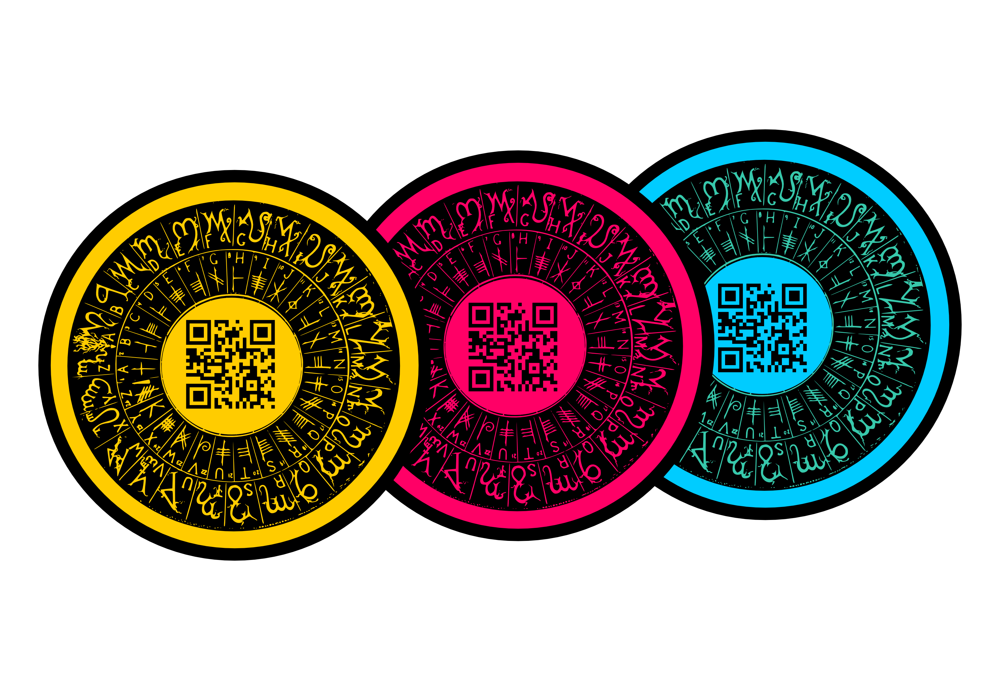

# Criptomonete

*Jorge Timón*
	

“Se chiedi ad un'economista "che cos'è il denaro?" probabilmente non ti risponderà con una definizione ma declamando le tre funzioni attribuite tradizionalmente al denaro. 
Vale a dire: essere un mezzo di scambio, un unità di valore e una riserva di valore”. Citando Bernard Lietaer[^1] e lasciando da parte se il denaro "buono", ammesso esista, debba e possa ancora fornire tutte queste funzioni, le opinioni su che cos'è esattamente sono spesso molto divergenti.

Alcune persone lo considerano un bene economico come qualsiasi altro, mentre altre negano che sia capitale reale (per non essere direttamente un mezzo di produzione) o che non sia un bene di consumo dato che non scompare quando passa da una mano all'altra. Inoltre è considerato tanto come un accordo sociale (implicitamente o esplicitamente imposto da uno stato) quanto semplicemente una tecnologia per lo scambio di beni e servizi.
Se ci interroghiamo sulla sua storia, una spiegazione comunemente accettata è che l'oro diventò denaro per essere il materiale più facilmente vendibile nel baratto. L'antropologo David Graeber[^2] nega l'esistenza di elementi di prova e propone l'economia del dono[^3] e gli scambi basati sul mutuo credito come le più probabili origini del commercio.

Le persone che sostengono una riforma del sistema monetario[^5] vedono nella struttura del denaro la radice di molti dei problemi delle nostre società.  Infatti, oggi ci sono e circolano più monete complementari/locali/sociali che monete ufficiali[^6]. Già in piena crisi del '29 il sindaco della cittadina tirolese di Wörgl[^7] ha deciso di mettere in pratica la teoria della moneta libera di Silvio Gesell[^8]. Nonostante il suo successo, la banca centrale austriaca ha fermato l'esperimento e ha impedito alle città vicine di copiare il modello.
Da parte sua, il movimento Cypherpunk[^9] nato negli anni '80, sostiene l'uso diffuso della crittografia come strumento di cambiamento sociale e politico. Nel 1990, David Chaum lanciò Digicash[^10], un sistema centralizzato di moneta elettronica che ha permesso transazioni più anonime e sicure. Nel 1997, Adam Black propose Hashcash[^11], basato sul testing per limitare lo spam (posta indesiderata) e la negazione di servizio (DoS). Nel 2009, un'identità sconosciuta sotto lo pseudonimo di Satoshi Nakamoto rendeva pubblico Bitcoin[^12], la primo criptovaluta completamente decentrata, che utilizza una catena di blocchi (blockchain) come prova della transazione, che sarà discussa in modo più dettagliato.

Da quando è apparsa, sono emerse molte altre criptomonete basate o ispirate da bitcoin, ma è importante notare che non tutte le valute sono p2p[^13] e decentralizzate. Alcune sono state create per aggiungere alcune funzionalità aggiuntive[^14], per differenti ideologie economiche[^15], per cercare di risolvere problemi tecnici[^16]; sebbene la maggior parte sono limitate a piccole transazioni senza importanza o create dal puro desiderio speculativo o di frode[^17]. In ogni caso, un prerequisito indispensabile per essere una valuta p2p è che il sistema sia basato su un software libero[^18], altrimenti non potrebbe essere sotto il controllo di chi la sviluppa e gli utenti non potrebbero fidarsi di esso.
 
### Principali agenti
 
#### Hacker ed altri entusiasmi
 
Inizialmente le uniche persone che usavano bitcoin erano appassionate di informatica, criptografia o software libero. Una pratica comune è stata, per esempio, pagare chi poteva migliorare, programmando, il software libero della moneta in fase di sviluppo con la moneta stessa. Altri gruppi che rapidamente sono stati attratti dalle somiglianze tra l'oro come moneta e bitcoin sono stati i seguaci della scuola austriaca[^19] (la potenza economica dominante nella comunità di monete p2p) e gli anarco-capitalisti[^20].
 
#### Chi mina

Hanno messo il loro hardware a disposizione della rete P2P per eseguire il test di lavoro (Proof of Workplace POW) su cui si basa la sicurezza della maggior parte di questi criptomonete. Mentre alcune persone, facendo ciò, sono riuscite ad accumulare una fortuna dovuta in parte alla sorte e alle grandi fluttuazioni positive nel prezzo delle valute, il "minare" è diventata un complesso business molto competitivo e rischioso dove è relativamente facile perdere i soldi, e sia per i costi di energia elettrica che per l'impossibilità di recuperare l'investimento iniziale.

#### Aziende, cooperative, collettivi  specializzati

Molte aziende sono sorte intorno a queste tecnologie per coprire nicchie di mercato come, ad esempio,: i mercati per lo scambio di criptomonete tra loro o valute ufficiali, le aziende che elaborano i pagamenti, eliminando i rischi di volatilità per chi commercia, portafogli web, annunci di bitcoin, micro-donazioni, etc. Si noti che molti sono solo adattamenti di modelli di business già esistenti per le valute in ambiente p2p. Ma molti altri invece stanno portando innovazioni in un settore disciplinato e controllato da cartelli come quello finanziario.

#### Chi specula

C'è chi si dedica all'arbitraggio tra i mercati esistenti ed effettivamente questo può essere un ruolo importante. Tuttavia, il tipo più comune di speculazione è semplicemente dedicata ad accumulare monete p2p con la speranza che aumentino di prezzo. Se il bitcoin non era sufficientemente di per sé volatile, chi specula sfrutta ora una varietà di nuove monete con mercati più piccoli (e quindi generalmente più volatili), su cui continuare a puntare.

#### Chi produce e commercia

Possono fidelizzare o ottenere ulteriori clienti accettando criptomonete. Corrono rischi derivati dalle fluttuazioni del prezzo delle valute (anche se ci sono servizi per attenuarli), ma usufruiscono di commissioni più basse e dell'irreversibilità delle transazioni. In confronto, gran parte delle commissioni delle carte di credito o servizi come PayPal è giustificata dall'elevato livello di frode in quanto i pagamenti possono essere cancellati in seguito.

#### Cittadinanza e organizzazioni no-profit

Ricevere donazioni in monete p2p è sempre stato estremamente semplice, basta mettere un indirizzo o un codice a barre su una pagina web o un volantino[^21]. Alcune organizzazioni senza scopo di lucro pioniere nell'accettare bitcoin ne hanno ricevuto notevoli quantità, e spesso sono diventate molto più preziose per il conseguente aumento del valore. Inoltre, le organizzazioni del terzo settore stanno sviluppando progetti e sperimentazione in questo campo. Ad esempio, il 90% della generazione di Devcoin[^22] è destinata a progetti di conoscenza libera, anche se le decisioni sono centralizzate. O anche Freicoin che consegna l'80% dell'importo iniziale emesso in 3 anni alla Fondazione Freicoin perchè siano distribuiti utilizzando metodi di sperimentali precedentemente accettati e sviluppate dalla comunità. Al momento c'è solo un programma di emissione costituito da una piattaforma di crowdfunding[^23] per organizzazioni e progetti senza scopo di lucro[^24]: chiunque può donare freicoins, e la fondazione fornisce un ulteriore 10%, senza dover scegliere direttamente la quantità di denaro da dare a ciascun progetto. Chiunque può controllare le operazioni sulla blockchain al fine di garantire che l'accordo sia stato fatto come previsto.

#### Censura e blocchi

Un altro vantaggio fondamentale è l'incapacità di applicare la censura. Da un lato, i pagamenti possono provenire da qualsiasi parte del mondo. Paypal tiene isolati più di 60 paesi e molte società di carte hanno restrizioni simili. Organizzazioni come Wikileaks sono stati bloccati da Visa, Mastercard e Paypal impedendo loro di ricevere donazioni in valute ufficiali, ma possono ricevere monete p2p.
Paradossalmente più povero è un paese, più alte sono le spese e gli interessi che fanno pagare. Spesso il totale di ciò che un paese paga in commissioni di istituzioni finanziarie straniere supera il totale degli aiuti ricevuti. Le persone immigrate che inviano soldi a casa spesso pagano anche oltraggiose commissioni del 10%, molto poco competitive confrontate con commissioni fisse assegnate da monete p2p (spesso meno di un centesimo di euro). Inoltre, in molti paesi, gran parte della popolazione adulta non ha accesso a un servizio finanziario o un conto corrente. In Kenya, il 31% del prodotto interno lordo viene trasferito attraverso i telefoni cellulari che utilizzano il sistema m-pesa[^25], un esempio di azienda collegata alle monete p2p[^26]

### Problemi e limitazioni

#### Macroeconomia

Riassumiamo solo brevemente le principali posizioni intorno alla "qualità" delle criptomonete come denaro in senso macroeconomico. La scuola austriaca accetta di buon grado l'approccio della creazione di un determinato importo massimo di denaro o di una sua creazione prevedibile. La scuola neokeynesiana[^27] invece, più numerosa e influenete, non trova il suo posto tra le criptomonete in quanto ritene che a volte l'economia "ha bisogno di più soldi".
Un altra corrente minoritaria e ignorata è la corrente avviata da Silvio Gesell, secondo il quale il problema non è la mancanza di soldi, ma la sua stagnazione. Quando i rendimenti di capitale e gli interessi sono bassi, chi risparmia semplicemente smette di investire e di prestare denaro. Freicoin[^28] per esempio applica una commissione di "ossidazione"[^29] per prevenire la stagnazione ed evitare l'affare di chi presta per avere un interesse maggiore.

#### Il problema dell'emissione

Mentre è necessario compensare chi "mina" per la sicurezza che fornisce, in futuro dovrebbero essere sufficienti le spese di transazione. In generale, la distribuzione iniziale di criptomoneta è una questione controversa sulla quale sicuramente si continuerà a sperimentare e fa anche riflettere sulla creazione della moneta ufficiale. Alcune persone pensano[^30] che sia un ruolo che non dovrebbero svolgere le banche commerciali e centrali, ma il signoraggio[^31] dovrebbe riceverlo lo stato.

#### Hardware specializzato

Un altro problema è quello dei circuiti integrati di applicazioni specifiche (ASIC[^32]). È hardware specializzato per un compito specifico, in questo caso, l'estrazione. L'argomento contro ASIC di solito è la centralizzazione, ovvero il timore che possa sorgere un monopolio o un'alta concentrazione di produzione e/o distribuzione. Ma anche se fosse possibile sfuggirle per sempre, non c'è univocità nel pensare che siano qualcosa da evitare[^33], c'è chi, ad esempio, sostiene che la centralizzazione esisteva quando il modo più efficiente di minare era grazie alle GPU (schede grafiche), in quanto il mercato è controllato praticamente da due società e in pratica la maggior parte di che "mina" acquista le stesse(ATI).

#### Pool e centralizzazione

Le pool (letteralmente *vasche* ntr) sono gruppi organizzati di persone che minano assieme e dividono il premio dei blocchi che ottegono a seconda della potenza di calcolo che ha portato ciascuna. Il problema è che solo chi gestisce la singola pool convalida il blocco a cui contribuiscono ad arrivare chi partecipa, potrebbe quindi abusare di questo potere per attaccare il sistema senza che chi "mina" lo noti e potendo anche truffarli.

#### Privacy e confidenzialità

Si leggono molte recensioni in Internet su come il presunto anonimato di Bitcoin la renda la valuta preferita dai criminali. Ma la realtà è che tutta la sua storia, tutte le transazioni sono pubbliche e chiunque può scaricare la catena di blocchi e vederla, allontandola quindi dal tipo ideale di moneta anonima.
Anche se non è neanche un sistema progettato per una sorveglianza horwelliana della finanza, perché chiunque può creare un numero qualsiasi di chiavi che ricevono i pagamenti e non avere il proprio nome direttamente associato con indirizzi (alias). A meno che, naturalmente, chi lo possiede non lo dica ad altre persone o lo pubblichi su Internet (o la connessione Internet sia sorvegliata[^34]). Alcuni progetti come coinjoin[^35] o darkwallet[^36] sono volti a migliorare la privacy degli utenti senza cambiare il protocollo di base di bitcoin. Altri progetti come zerocoin[^37] scelgono di modificarlo (creare una nuova criptovaluta) per fornire più anonimato, anche se questo può significare meno efficienza o altri effetti indesiderati.

#### Scalabilità

Una delle sfide più importanti che devono affrontare queste monete è la loro capacità[^38] a lungo termine di crescere in numero di transazioni elaborate. VISA, per esempio, elabora una media di 2000 transazioni al secondo (TPS) e può elaborare fino a 10000 tps. Al contrario, Bitcoin può elaborare solo fino a 7 tps, anche se alcuni dei limiti massimi imposti sono artificiali. C'è un delicato compromesso tra la scalabilità e la centralizzazione, come con molte transazioni, meno persone opereranno nodi completi (al contrario dei *thin client*[^39]).

#### Conclusioni

E' probabile che nel breve e medio termine le criptomonete rimangano molto volatili. Come si possono guadagnare soldi speculando in fretta sul loro valore, così si possono perderli, quindi non è sensato rischiare su grandi quantità. Inoltre, dobbiamo guardare con attenzione alle più nuove, perché spesso si tratta di piccoli progetti di comunità che possono fornire solo un accesso limitato alla manutenzione del software.
Organizzazioni e progetti senza scopo di lucro, tuttavia, non sono a rischio ad accettare donazioni in queste valute: è una cosa relativamente semplice da fare e in grado di fornire un'ulteriore fonte di reddito. Per chi lavora come freelancer può essere uno strumento molto utile per le assunzioni in qualsiasi parte del mondo, ma come tutte le altre persone che commerciano o producono, è responsabile della vendita a breve per delle monete ufficiali in una percentuale sufficiente a non soffrire i rischi connessi con la sua volatilità.
Indipendentemente da qualunque sia il destino di ogni moneta, la tecnologia offre vantaggi sufficienti per aspettarsi che alcune di esse (o altre che si stanno per creare) trovino il loro posto a lungo termine nella società. In un certo senso, il loro potenziale dirompente per l'industria monetaria e finanziaria è paragonabile a quella che le tecnologie P2P come bittorrent[^40] hanno arrecato all'industria del copyright. È improbabile, tuttavia, a causa di alcune limitazioni, che queste monete siano le uniche, essendo più realistica la loro coesistenza con le valute ufficiali e la crescente tendenza di altre valute complementari (locali, sociali, tra le imprese B2B[^41] ecc).

---- 

*Jorge Timón* 
Ingegnere informatico con più di 4 anni di esperienza in Indra <bho> , lavorando su diversi progetti internazionali, tra cui software per alcune grandi compagnie di assicurazione. Ha contribuito alla progettazione del protocollo distribuito Ripple (Prima dei Ripple Labs) sviluppato da Ryan Fugger. Ha proposto e co-progettato Freicoin. E' il principale sviluppatore <de la página ??> per la Fondazione Freicoin. E' stato relatore nella seconda conferenza internazionale sulle monete complementari e tra le altre, anche al Bitcoin Europa 2013.

----

##### NOTE

[^1]:	http://en.wikipedia.org/wiki/Bernard_Lietaer/
[^2]:	https://it.wikipedia.org/wiki/Debito._I_primi_5000_anni
[^3]:	https://it.wikipedia.org/wiki/Economia_del_dono
[^4]:	http://en.wikipedia.org/wiki/Mutual_credit
[^5]:	https://it.wikipedia.org/wiki/Riforma_monetaria
[^6]:	http://www.complementarycurrency.org/ccDatabase/
[^7]:	http://en.wikipedia.org/wiki/Worgl#The_W.C3.B6rgl_Experiment
[^8]:	http://en.wikipedia.org/wiki/Silvio_Gesell
[^9]:	http://en.wikipedia.org/wiki/Cypherpunk
[^10]:	http://en.wikipedia.org/wiki/DigiCash
[^11]:	http://en.wikipedia.org/wiki/Hashcash
[^12]:	http://it.wikipedia.org/wiki/Bitcoin
[^13]:	http://it.wikipedia.org/wiki/Peer-to-peer
[^14]:	http://dot-bit.org/
[^15]:	http://freico.in/
[^16]:	http://peercoin.net/
[^17]:	https://bitcointalk.org/index.php?topic=361813.0 contiene il seguente video "esplicativo": http://www.youtube.com/watch?v=xcaltexI-mW0
[^18]:	 https://it.wikipedia.org/wiki/Software_libero
[^19]:	 https://it.wikipedia.org/wiki/Scuola_austriaca
[^20]:	 https://it.wikipedia.org/wiki/Anarco-capitalismo
[^21]:	 http://lifeboat.com/blog/2013/12/a-college-kid-made-over-24000-yesterday-just-by-waving-this-sign-on-espn
[^22]:	 http://devcoin.org/
[^23]:	 http://it.wikipedia.org/wiki/Crowdfunding
[^24]:	 http://foundation.freicoin.org/#/donations
[^25]:	 http://en.wikipedia.org/wiki/M-Pesa
[^26]:	 http://kipochi.com/blog/kipochi-launches-first-bitcoin-wallet-in-africa-with-m-pesa-integration
[^27]:	 http://en.wikipedia.org/wiki/Neo-Keynesian_economics
[^28]:	 http://freico.in/
[^29]:	 http://en.wikipedia.org/wiki/Demurrage_(currency)
[^30]:	 http://www.positivemoney.org/
[^31]:	 https://it.wikipedia.org/wiki/Signoraggio
[^32]:	 https://it.wikipedia.org/wiki/Application_specific_integrated_circuit
[^33]:	 http://www.coindesk.com/bitcoin-developer-jeff-garzik-on-altcoins-asics-and-bitcoin-usability/
[^34]:	 http://en.wikipedia.org/wiki/Global_surveillance_disclosures_(2013%E2%80%93present)
[^35]:	 https://bitcointalk.org/index.php?topic=279249.0
[^36]:	 https://darkwallet.unsystem.net/
[^37]:	 http://zerocoin.org/
[^38]:	 http://en.wikipedia.org/wiki/Scalability https://en.bitcoin.it/wiki/Scalability
[^39]:	 https://en.bitcoin.it/wiki/Thin_Client_Security
[^40]:	 https://it.wikipedia.org/wiki/BitTorrent
[^41]:	 https://fr.wikipedia.org/wiki/Business_to_business_%28Internet%29

