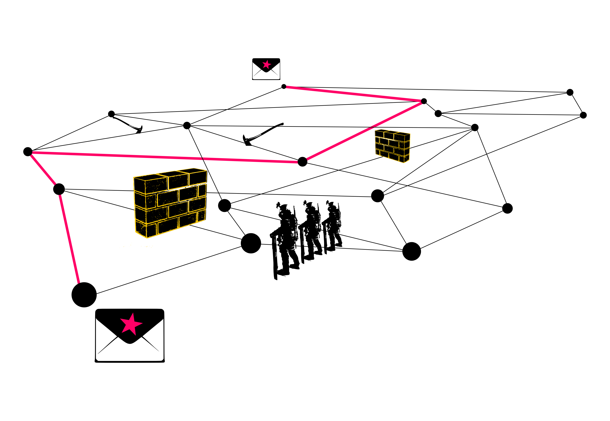

# Decentralizzazione e reti sociali

*Hellekin*

	

Praticamente sconosciuto dal pubblico fino a due decadi fa, il termine "rete sociale" appare ogi come un'innovazione del **Web 2.0**[^1]. Tuttavia, si tratta di un concetto molto anteriore al fenomeno di concentrazione mercantile degli strumenti che si dedicano alle reti sociali. Nel 1993 il sociologo Jacob Levy Moreno[^2] introdusse il sociogramma, una rappresentazione grafica delle relazioni interpersonali nelle quali ogni nodo è una persona e ogni collegamento una relazione sociale. Il termine "rete sociale" comparve per la prima volta nel 1954 in un articolo del professore John Arundel Barnes[^3] per concludere la sua investigazione sulle relazioni sociali in un villaggio di pescatori norvegesi.

Howard Rheingold[^4], pioniere nelle comunità virtuali e cronista visionario dei cambi sociali indotti dalle tecnologie dell'informazione e comunicazione, sottolineava come "Alcune persone confondono le reti sociali, che sono la somma delle relazioni umane, con i servizi on line **per** le reti sociali, come Facebook e G+". Tale confusione fa sembrare il servizio l’origine della rete sociale, nonostante il suo ruolo sia limitato, nel migliore dei casi, a facilitare il suo emergere.

***Rete centralizzata, decentralizzata, distribuita?***

Questi concetti si evolvono a partire dall'articolo di Paul Baran[^5] dedicato alle differenti tipologie di reti di comunicazione[^6]. Nel seguente paragrafo si presentano queste caratteristiche da una prospettiva più sociale che tecnica.

Si dice che una rete è centralizzata quando la sua integrità dipende da un attore senza il quale la rete non può funzionare. Tale archittettura ha numerosi vantaggi per l'integrazione verticale dei servizi, in particolare perchè ha un vertice decisionale unico, e perchè la soluzione tecnica tende all'uniformità. Questo modello combina un utilizzo semplificato, la facilità di sviluppo e la stabilità del sistema; senza dubbio impone una posizione speciale all'amministratore del sistema, che gli permette osservare e analizzare i suoi utenti. Propone quindi poca o nessuna protezione o considerazione per il dirtitto alla privacy degli utenti.

Una rete decentralizzata non dipende da un polo unico di decisione, anche se ogni membro della rete non è necessariamente autonomo, e può dipendere dalla disponibilità di un server che lo unisce al resto della rete; la federazione è il modello tipico della rete decentralizzata: la posta elettronica o le reti di chat[^7] sono esempi di sistemi federati decentralizzati. Questo modello è perfetto per organizzazioni che possono mantenere le proprie infrastrutture di comunicazione e preferiscono controllare le proprie comunicazioni. Però presenta la stessa problematica di una rete centralizzata rispetto al ruolo di intermediario-che-può-tutto (in termini di sicurezza informatica, il "**man in the middle**[^8]").

Quando ogni nodo della rete decentralizzata è autonomo, si parla di rete distribuita: è il modello di rete di pari (P2P) come Bittorent[^9], GNUnet[^10], Tor[^11], I2P[^12], cjdns[^13], o Bitcoin[^14]. Questo modello è il più robusto contro le aggressioni di un potere centralizzato (osservazione, censura, manipolazione), perché non permette nessun angolo di attacco, né vuoto speciale, non dispone di un "punto unico di caduta", come succede con i modelli precedenti. Senza dubbio la sua realizzazione è molto più difficile di quella di un servizio centralizzato, specialmente per il tema dell'eterogeneità e la complessità del campo.

Queste architteture non sono necessariamente in opposizione tra di loro[^15]. La contraddizione si radica invece nella decisione di proteggere la privacy degli utenti o, al contrario, di stabilire la loro vigilanza. Il focus attualmente dominante degli strumenti per le reti sociali dipende radicalmente dalla vigilanza degli utenti e, di conseguenza, ricerca un'architettura centralizzata e propietaria, che favorisce il controllo.

Non bisogna nemmeno confondere la capacità di "esportare" dati con la loro "portabilità", né con la loro disponibilità. L'esportazione dei dati da un servizio o da un'applicazione funziona nella maggior parte dei casi con un circuito chiuso. Alienati dal loro contesto, questi dati esportati sono solamente un'enormità di cartelle inerti, visto che è il loro inserimento in un contesto sociale quello che gli da vita (la loro connessione incessante crea un'interdipendenza tra le diverse fonti).

Così, più in la di una guida tecnica, spesso astratta e incompleta visto che considera solo un aspetto formale della rete, è necessario riconoscere i fondamenti e la complessità delle conseguenze etiche, sociali, politiche e economiche delle tecnologie che danno supporto alla sociabilità degli individui e delle collettività. 

***Che fare?: Software libero e reti libere***

L'Apocalisse secondo Snowden (le sue rivelazioni scandalose sulla NSA) confermano quello che dicono, da trent’anni, i programmatori di software libero[^16]. Per valutare la sicurezza di un sistema è imprescindibile che questo possa essere osservato. Un sistema non verificabile è, per definizione, un atto di fede nel suo creatore, come già prevedeva con ragione Ken Thompson nel 1984[^17]. Un sistema informatico del quale non si può studiare il codice sorgente non può essere considerato come sicuro[^18].

Il software libero[^19], nel senso dato dalla Free Software Foundation[^20] e il progetto GNU[^21], significa che gli utenti dispongono di quattro libertà fondamentali: 0) usare il software secondo la propria volontà; 1) studiare il funzionamento del software (attraverso il codice sorgente); 2) condividere il software liberamente, anche commercializzandolo; 3) modificare il software secondo le proprie necessità e distribuire liberamente queste modifiche. Queste quattro libertà fondamentali permettono all’utente l'appropiazione libera dei software, cioè il loro controllo; questo favorisce la valutazione del codice tra pari, come i lavori scientifici. Si tratta, quindi, di software prettamente politico, sviluppato in seno all'interesse generale.

Il campo del software libero che propone alternative per le piattaforme propietarie è ancora abbastanza sperimentale. Però la sua effervescenza dimostra la possibilità di poter contare su strumenti di gestione di reti sociali che non siano ne propietarie ne liberticide. Che vengano dal Web, orientate verso una decentralizzazione federata, o che vengano dalla rete tra pari (P2P), puntando verso un modello più distribuito tra nodi autonomi, queste iniziative si oppongono per definizione alla vigilanza degli utenti e promuovono le loro libertà.

Il progetto GNU consensus[^22] ha come obbiettivo promuovere e coordinare lo sviluppo di software libero di carattere sociale. Considerando che un'entità ostile[^23] partecipa attivamente nella rete, il progetto raccomanda che ogni nodo della rete possa proteggersi da questa minaccia, e proteggere anche i suoi legittimi interlocutori. In questo campo, la maggior parte delle alternative disponibili procurano poca protezione contro gli attaccanti più sofisticati. Senza dubbio, permettono una transizione necessaria dalle plattaforme propietarie, in quanto queste, per definizione, sono compromesse poiché partecipano alla vigilanza globale. La cifratura sistematica dei dati e la protezione delle interazioni sociali di ciascuna formano parte degli elementi necessari per un'alternativa forte e praticabile. GNU consensus promuove l'adozione a lungo termine della piattaforma di reti di pari GNUnet[^24], e il suo complemento per le reti sociali chiamato Secushare[^25] è ancora in fase di ricerca.

Fino a che non sarà disponibile GNUnet per il pubblico generale, il progetto si impegna a identificare le soluzioni capaci di facilitare l'esodo degli utenti dei servizi propietari verso le soluzioni libere. È importante precisare che se questo progetto considera GNUnet come referente, non esclude la diversità di approcci. Così il progetto promuove anche software che facilitano una soluzione parziale, cercano di identificare le proprie limitazioni e riconoscere i vantaggi. 

La sezione seguente offre uno sguardo parziale dei possibili problemi e soluzioni alternative. Il sito del progetto GNU consensus offre una visione più elaborata e attuale. Il lettore può anche rimettersi alla lista collaborativa mantenuta dal sito di Prism Break[^26], che offre una corrispondenza tra le applicazioni e i servizi propietari e le alternative libere.

***Problematiche e alternative emancipatrici***

*Pubblicazione*: La forma corrente di pubblicazione personali continua a essere il blog, e i commenti formano conversazioni ricche dentro la "blogsfera"; anche il wiki offre una forma di pubblicazione collettiva nella quale l'aspetto sociale è più discreto. Senza dubbio queste due forme coinvolgono comunità specializzate e letterarie. D'altro canto, coinvolgono soprattutto le interazioni pubbliche.

*Esibizione e rumore*: Facebook è l'esempio più famoso per lo scambio di esperienze sociali. Twitter ha saputo combinare la brevità degli SMS con il Web per creare uno dei servizi più popolari e additivi del Web. Google+ offre un compromesso tra i due.

La "monetizzazione" dei benefici e l'appropriazione mercantile dei contenuti dipende dalla volontà degli utenti di sottomettersi alla macchina della vigilanza scambiando dei vantaggi percepibili come una sottomissione troppo astratta, dimenticandosi delle consequenze: esibizionismo a oltranza, delazione trivializzata, diffusione del capitale sociale verso i circuiti capitalisti superflui. Le consequenze dell'amplificazione delle conversazioni più in là delle semplici premesse del "che stai facendo?" permette di catturare una parte importante della socialità delle reti fino al punto che molti utenti di Facebook oggi lo confondono con "l'Internet".

La maggioranza dei "cloni di Twitter" continuano a essere incompatibili con l'originale, così come vuole la politica dell'impresa, però stanno lavorando per l'interoperatività: tra gli altri, GNU social[^27], Friendica[^28], Pump.io[^29]. Una soluzione distribuita che usa la stessa tecnologia di Bitcoin è ancora in fase di sperimentazione: Twister[^30].

*Conversazioni e organizzazione collettiva:* La maggior parte delle soluzioni alternative esistenti si presentano sotto la forma di compartimenti incompatibili tra loro. Queste soluzioni sorpassano, senza dubbio, il motivo della logorrea per proporre mezzi di organizzazione collettiva. Possiamo nominare alcuni esempi come Elgg[^31] e Lorea[^32], Crabgrass[^33], Drupal[^34], e il Web Indipendente[^35] che è allo stesso tempo pioniere nella definizione e nell'adozione di standard dal Web Semantico, e di resistenza alla tendenza centralizzatrice dei mercati.

*Telefonia e videoconferenze:* Dopo essere stato comprato da Microsoft, Skype è passato nei ranghi dei collaboratori diretti della NSA. Google Hangout è accessibile solo per gli utenti di Google. Nei due casi, possiamo usare vantaggiosamente l'alternativa di Jit.si[^36], o aspettare l'arrivo del Project Tox[^37].

*Messaggistica:* La posta elettronica continua a essere una delle applicazioni più diffuse. L'uso di GnuPG permette la cifratura dei messaggi però non protegge la fonte, il destinatario nè l'oggetto del messaggio (il progetto LEAP[^38] sta cercando la soluzione a questo problema. La dominazione di Google in questo ambito di servizi, con Gmail e GoogleGroups, diminuisce considerevolmente il suo aspetto federativo. Mentre aspettiamo di usare soluzioni specializzate come Pond[^39], I2P-Bote[^40], o BitMessage, si raccomanda di usare un servizio di mail autonomo che alimenta la sicurezza, come Riseup[^41] o Autistici[^42], o montare il proprio server.

*Condividere video:* La supremazia di Youtube (Google, un'altra volta) in questo ambito lascia i suoi competitori molto indietro. Data l'enorme infrastruttura necessaria per il trattamento e l'invio di file video, questo servizio non ha molte alternative. GNU Media Goblin[^43] permette a un sito di gestire i propri media e supporta solo formati di video liberi. Un nuovo progetto, Wetuber, promette di innovare e rimpiazzare Youtube con una rete distribuita usando un approccio simile a quello di Twister, che si basa in una catena di blocchi, e offre ai partecipanti il regalino di una rimunerazione corrispondente alla banda condivisa.

*Condividere musica*: Il riferimento proprietario continua a essere SoundCloud. Sembra che ci sia poco interesse nella creazione di un’alternativa libera a questo servizio. GNU MediaGoblin accetta anche file audio, e potrebbe assumere questo ruolo. Gli appassionati di musica possono usare Bittorrent facendo attenzione a scaricare torrent legali ed eliminare con liste di blocchi (blocklists) i nodi specializzati nella caccia agli internauti o la disseminazione di software contaminato dalla loro connessione.

***Altri esempi pertinenti per immaginare applicazioni e implicazioni future***

*Applicazione statica*:  Il progetto UnHosted[^44] propone di ristabilire la decentralizzazione delle applicazioni Web separando il codice dai dati coinvolti. Questi restano sotto il controllo dell’utente, e le applicazioni si eseguono con il browser e non in un server.

*Condividere il codice*: Github offre un contro-esempio di servizio proprietario sociale. La sua contribuzione al mondo del software libero ci insegna che è possibile incontrare un mercato il cui sfruttamento commerciale non passa per il commercio dei dati degli utenti, né per nessuna restrizione delle loro libertà. Indubbiamente ha due competitori importanti, Gitlab e Gitorious, ed esiste anche una versione P2P, Gitbucket. Il codice sorgente di Gitlab e Gitbucket si trova in Github! Il modello di Github può servire come idea per il “comunismo d’impresa” proposto da Dmytri Kleiner[^45].

*Videogiochi massivi condivisi online*: I MMORPGs[^46] sono anche luoghi di incontro e di socialità. Se è più facile di parlare delle cose della vita in Second Life, le relazioni sociali esistono anche in Word of Warcraft o Minecraft. Solo che questi mondi virtuali generano un’economia e una fascia della società del primo mondo che sono loro propri. Sono luoghi in cui l’anonimato non è un problema, ma quasi un obbligo: chi vuole sapere che il grande mago Krakotaur passava la sua gioventù a perforare schede per darle da mangiare a un computer delle dimensioni dell’ingresso di un palazzo? Se vi ispira, potete unirvi a PlaneShift[^47] o agli universi di sviluppo di CrystalSpace[^48] per immaginare il futuro dei giochi di immersione liberi.

**Conclusioni**
Il grande sviluppo delle reti libere si unisce a quello del software libero: quello dell’autonomia e della sua perennità. L’appoggio finanziario agli sviluppi, da un lato, e al marketing delle soluzioni, dall’altro, si trova al centro delle problematiche che ne limitano l’autonomia. L’infrastruttura necessaria per la liberazione dei cittadini della rete deve arrivare in maniera prioritaria dagli stessi utenti. Può rendersi autonoma solo se i suoi utenti se ne fanno carico, così come si fanno carico di altre risorse necessarie per la preservazione della loro comunità. Lo sviluppo sostenibile e la disponibilità di una infrastruttura di comunicazione pubblica e sociale si può creare solo se una massa critica di partecipanti percepisce la sovranità tecnologica come un bene comune. L’onnipresenza del “tutto gratuito” nasconde capitali colossali investiti dalle imprese per catturare il loro pubblico. Il tutto gratuito è un modo di soffocare i competitori: perché a questo gioco possono giocare solo quelli che hanno già grandi riserve finanziarie. Senza dubbio, dopo le rivelazioni di Snowden che espongono l’estensione della vigilanza globale, possiamo vedere alcune conseguenze nell’evoluzione dei modi di utilizzo degli strumenti di ricerca[^49] o nel germogliare di una certa attenzione verso il software libero da parte di alcune istituzioni. Questa tendenza deve accompagnarsi con una presa di posizione degli utenti nelle loro scelte tecnologiche, materiali e di software, e nella decisione di appoggiare gli sforzi di sviluppo alternativo. 
La campagna annuale di finanziamento di Wikipedia annuncia che se ogni persona che legge l’annuncio contribuisse con solo tre dollari, la raccolta fondi sarebbe terminata in due ore! È la consapevolezza di questa realtà, del potere dei grandi numeri, che ci manca per poter iniziare a materializzare una visione democratica di Internet libera e pubblica. Se la cittadina, isolata come individuo, non ha grandi quantità di denaro, le campagne di crowdfunding permettono di raccogliere rapidamente i fondi necessario per un progetto. 
Il crowdfunding continua a essere, senza dubbio, una forma di prestazione di risorse che appartengono al consumo: il “finanziatore” è un compratore che paga in anticipo il prodotto che gli viene proposto. Al contrario, una campagna di questo tipo dovrebbe essere un inverstimento che rafforzi l’infrastruttura pubblica generata. Questa è l’argomentazione che sviluppa Dmytri Kleiner nel suo Manifesto Telecomunista. Ogni comunità dovrebbe poter gestire i suoi investimenti, come già proponeva nel 2009 il progetto Lorea.
È chiaro che le scelte di tipo tecnologico dipendono da un’élite adatta alle analisi tecniche, e le innovazioni scientifiche sono permanenti. Però le scelte etiche non dipendono dalle capacità tecniche. Se i tecnici conoscessero gli orientamenti etici di una comunità, dovrebbero essere capaci di prenderle in considerazioni nelle loro analisi. La vigilanzia globale è nata perché è tecnicamente possibile, e perché questa scelta tecnica si è realizzata senza restrizioni di orgine etico o legale, con totale impunità. 
Software libero, servizi decentralizzati, distribuiti, riproducibili e comunitari, nodi autonomi, partecipazione e investimento sono le chiavi di un’infrastruttura di comunicazione pubblica, sostenibile e sana. Un’infrastruttura non solo in grado di preservare la vita privata dei cittadini, proteggere la libertà degli individui e dei popoli in lotta contro regimi totalitari, ma anche di forgiare le basi della democrazia del ventunesimo secolo, per affrontare insieme, nella pluralità e diversità delle situazioni individuali e collettive, le immense problematiche planetarie. L’avvenire delle reti sociali inizia dalla loro base: ovvero da noi stessi. 

---

**Hellekin**
Maintainer ufficiale del progetto GNU consensus. Sviluppatore a tempo perso, attivista a tempo pieno, naviga nelle reti e nei continenti in cerca di soluzioni per l’empowerment della razza umana a partire dai suoi ideali libertari.
Nella sua base in America Latina aiuta a costruire una comunità e una infrastruttura libera per le reti di comunicazione elettronica per difendere e promuovere le iniziative locali e decentralizzate. GnuPG: 0x386361391CA24A13 - *hellekin[at]cepheide[dot]org*
---

###### Note

[^1]: La rete 2.0 è un concetto commerciale inventato per valutare la comparsa di siti interattivi di carattere sociale. Il “2.0” non rappresenta qui nessuna caratteristica tecnica, però cerca di tracciare l’obsolescenza di quello che esiste, cioè il Web delle origini, rete tra pari e decentralizzata 

[^2]: https://it.wikipedia.org/wiki/Jacob_Levi_Moreno

[^3]: Barnes, John (1954) “Class and Committees in a Norwegian Island Parish”, in Human Relations, (7), pp 39-58

[^4]: https://it.wikipedia.org/wiki/Howard_Rheingold

[^5]: https://es.wikipedia.org/wiki/Paul_Baran

[^6]: Baran, Paul (1962) “On Distributed Communications Networks”, presentato nel Primo Congresso di Scienza dei Sistemi di Informazione organizzato dal MITRE. 

[^7]: La “chiacchierata” è stata possibile per il basso costo delle comunicazioni digitali che si ottiene usando i protocolli Internet Relay Chat (IRC) eXtensible Messaging Presence Protocol (XMPP), molto prima che apparissero applicazioni proprietarie e limitate come MSN o la chat di Facebook.

[^8]: https://it.wikipedia.org/wiki/Attacco_man_in_the_middle

[^9]: https://it.wikipedia.org/wiki/BitTorrent

[^10]: https://it.wikipedia.org/wiki/GNUnet

[^11]: https://it.wikipedia.org/wiki/Tor

[^12]: https://it.wikipedia.org/wiki/I2P

[^13]: http://cjdns.info/

[^14]: https://it.wikipedia.org/wiki/Bitcoin

[^15]: Un servizio centralizzato usa spesso la distribuzione nella sua stessa struttura per assicurarsi la sua possibilitò di espansione su larga scala.

[^16]: Nel 2014 la FSF ha compiuto trent’anni dalla sua creazione.

[^17]: Thompson, Ken (1984) “Reflections on Trusting Trust”, URL: http://cm.bell-labs.com/who/ken/trust.html (Si noti l’uso tendenzioso della parola “hacker” nella sua accezione negativa, e come le sue riflessioni si possano applicare oggi agli abusi dei servizi segreti).

[^18]: La complicità dei giganti del software proprietario nella vigilanza globale capitanata dalla NSA dovrebbe fare di questo punto qualcosa di indubitabile

[^19]: Stallman, Richard (1996), “Che cosa è il software libero”? URL: https://gnu.org/philosophy/free-sw.it.html

[^20]: La complicità dei giganti del software proprietario nella vigilanza globale capitanata dalla NSA dovrebbe fare di questo punto qualcosa di indubitabile

[^21]: https://gnu.org/home.fr.html

[^22]: https://gnu.org/consensus

[^23]: Fuorilegge: criminali e spammers, servizi segreti, aziende e governi totalitari etc.
[^24]: https://gnunet.org/

[^25]: http://secushare.org/

[^26]: http://prism-break.org/fr/

[^27]: https://gnu.org/s/social/

[^28]: http://friendica.com/

[^29]: http://pump.io/

[^30]: http://twister.net.co/

[^31]: http://www.elgg.org

[^32]: https://lorea.org/

[^33]: https://we.riseup.net/crabgrass

[^34]: https://drupal.org/

[^35]: http://indiewebcamp.com/

[^36]: meet.jit.si per il servizio e http://jitsi.org/ per il software.

[^37]: http://tox.im/  ha come obiettivo la sostituzione di Skype con una soluzione libera

[^38]: https://leap.se/fr

[^39]: https://pond.imperialviolet.org/

[^40]: https://es.wikipedia.org/wiki/I2P

[^41]: https://help.riseup.net/es/email

[^42]: http://www.autistici.org

[^43]: https://gnu.org/s/mediagoblin

[^44]: https://unhosted.org/

[^45]: Kleiner, Dmytri (2010), “Il manifesto telecomunista »”, URL: http://telekommunisten.net/the-telekommunist-manifesto/

[^46]: MMORPG : Massively Multiplayer Online Role Playing Games

[^47]: http://www.planeshift.it/

[^48]: https://en.wikipedia.org/wiki/Crystal_Space

[^49]: StartPage, Ixquick e DuckDuckGo hanno quintuplicato l’affluenza ai loro motori di ricerca dopo che alcuni articoli su Der Spiegel e The Guardian ne hanno parlato nel 2013

