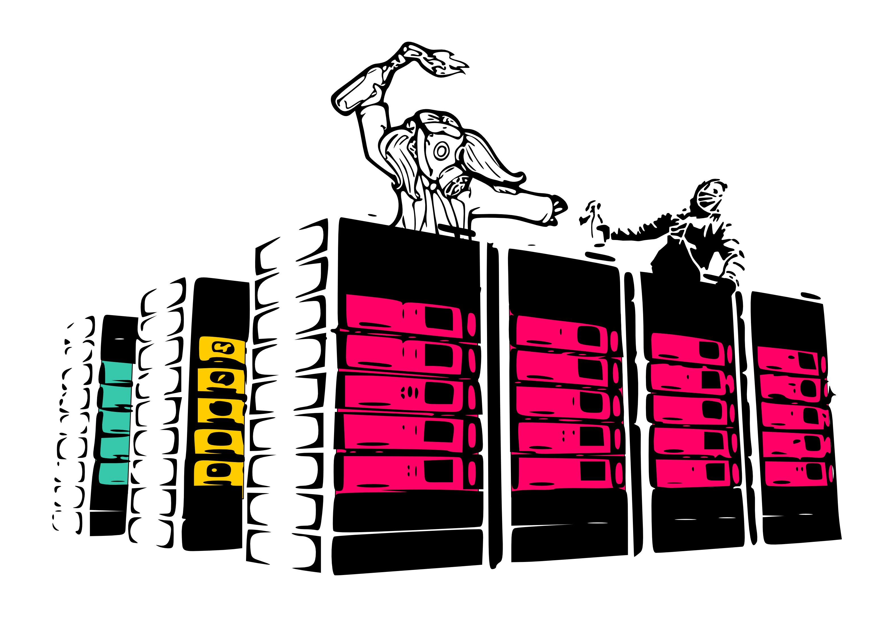

#Server Autogestiti

##Tatiana de la O

Per Wikipedia, in informatica “un server è un nodo che essendo parte di una rete, offre servizi agli altri nodi detti client. Si tratta di un computer sul quale si esegue un programma che realizza alcune mansioni in beneficio ad altri applicativi chiamati client, sia che si tratti di un computer centrale (mainframe), un minicomputer, un PC, una PDA o un sistema embed; tuttavia, i computer destinati esclusivamente a fornire i servizi di questi software sono i server per antonomasia”. 
Riassumendo semplicemente, quando un persona collega il computer a Internet e digita nel browser l'indirizzo di un sito web che si desidera visitare, i contenuti di questo sito sono ospitati su un server. Questi possono essere di varia natura e nel seguente articolo esploriamo i server chiamati autonomi.

**Che cos'è un server autonomo?**

I server autonomi possono essere definiti come server autogestiti la cui esistenza dipende dal lavoro volontario e/o salariato dei loro manutentori quando ricevono finanziamenti dalla comunità di utenti a cui servono. Essi, pertanto, non dipendono da un istituto pubblico o privato per operare. 
In ogni caso, l'autonomia di questi servizi può variare, alcuni accettano sovvenzioni o sono ospitati in istituti scolastici mentre altri possono essere nascosti in un ufficio o alloggiati in un centro educativo o d'arte e non hanno bisogno di tali finanziamenti.
I server autonomi sono nati come una delle numerose iniziative dei collettivi di hacktivisti per democratizzare l'accesso alle informazioni e alla produzione di contenuti, alla pari con altre attività come la creazione di punti di accesso alle tecnologie e Internet, seminari di formazione, reti libere, lo sviluppo di programmi o sistemi operativi liberi, ecc

Ci sono diversi tipi e taglie di server autogestiti, dal piccolo server di posta e web di pochi web designer a servizi noti come la posta elettronica di Riseup[^1] o al servizio di blog personalizzabili come noblogs.org. <ho tradotto come personalizzabili perchè in spagnolo "personales" non mi sembrava rendere il significato reale di noblogs, ovvero blog di collettivi/gruppi e non di singole persone> Molti informatici tengono un server in casa connesso ad una normale connessione domestica dal quale possono fornire siti web, posta, torrent o semplicemente un accesso ad un archivio condiviso con i suoi amici o familiari.
Non è necessario una licenza per avere un server, solo un computer collegato a Internet e un cambiamento nella configurazione del router di casa. La responsabilità non è così grande quando non è previsto un servizio capillare e importante. E se non ci sono molte persone collegate ad esso, non c'è bisogno di gran larghezza di banda.

Da alcuni anni non è così facile lasciare parcheggiato un server presso l'università o in azienda. Con le nuove leggi di controllo dei cittadini su Internet[^2], multe per la violazione del diritto d'autore[^3] e casi di frode[^4], le istituzioni non vogliono ospitare i server senza averne alcun controllo, e molti gruppi scelgono di passare a data center commerciali per dare maggiore stabilità al loro servizio, perché avere un server nel proprio armadio a casa può implicare molti episodi di disconnessione.

**A che ci serve avere dei server autonomi?**

Parallelamente, l'industria dell'informazione ha ottenuto monetizzare ogni volta di più i propri utenti e non necessita più chiedergli denaro per renderli redditizi. Servizi basici come ospitare siti web o caselle di posta sono sempre più offerti da imprese e non da collettivi ‘politicizzati’. Per esempio, molti attivisti usano la casella di posta su Gmail o pubblicano le proprie foto in Flickr gratuitamente. Queste aziende non necessitano di riscuotere direttamente del denaro dagli utenti per l'utilizzo, dato che si fanno pagare da terzi parti per avvalersi dei loro utenti attraverso l'esposizione alla pubblicità, o l'utilizzo dei contenuti che questi utenti hanno generato e sono memorizzati su server.
Continuare a creare ed utilizzare servizi autonomi in generale e server in particolare è importante per tante ragioni che andiamo a vedere. Grazie ai diversi aspetti che analizzeremo è facile dedurre che difendere ed appoggiare i server autonomi più vicini (di lingua , politici , geografici) si traduce in un Internet basato su valori comuni, dove le persone che tengono i nostri servizi lo fanno per sostenere quello che facciamo e non per venderci alle autorità o agli inserzionisti. 
La pratica da la forma agli strumenti e gli strumenti modellano le pratiche. 

Non è la stessa maniera di lavorare che ha dato origine al sistema di lavoro collaborativo di Wikipedia piuttosto che alle applicazioni installabili di Facebook, o l'Android market dove l'interesse è prevalentemente commerciale .

**Diversità**

Ogni nuovo collettivo nell'incorporare la propria idiosincrasia e il suo modo di lavorare, nuovi strumenti e relazioni affini, attraverso una rete di altri collettivi, rinforza la scena e la fa evolvere. Non è lo stesso un servizio di posta elettronica che uno di 

blog, o uno dedicato alle gallerie di foto. Ci sono server indipendenti che forniscono servizi di telefonia, o la condivisione di file. Ci sono server antimilitaristi o femministi o server per la diffusione di festival d'arte o per condividere file o software. In questi stessi server si sviluppano nuovi strumenti creativi con interessi non commerciali. Inoltre, dobbiamo anche tenere a mente che ogni paese ha situazioni giuridiche diverse per quanto riguarda i diritti e le responsabilità dei server. Per questo è fondamentale che server autogestiti nascano in differenti paesi. Ognuno sviluppando un modo diverso per finanziarsi, dei termini di servizio adattati alle esigenze dei loro sostenitori, e riceveranno apprezzamenti sul progetto ed i servizi offerti in modo ovviamente molto più vicino rispetto alle grandi multinazionali.

**Decentralizzazione**

La centralizzazione delle informazioni comporta rischi che sono difficili da capire per le persone poco esperte in questioni tecnologiche. Con l'aumento della capacità di storage e di elaborazione delle informazioni, i piccoli dati che le persone regalano ai server commerciali smettono di essere innoffensivi visto che, con la loro accumulazione, si possono ottenere chiari dati statistici sul consumo, la risposta alla pubblicità, la navigazione, ecc.
Se tutti avessimo dei piccoli server, con distinti modi di lavorare e diversi strumenti, in differenti paesi, e mantenuiti da diverse persone, sarebbe difficile tagliare i servizi tutti allo stesso tempo o sapere chi bloccare per paralizzare una rivolta o sedare un movimento.
La centralizzazione delle informazioni minaccia la neutralità della rete, come abbiamo visto in Birmania nel 2007, quando 'il governo staccò Internet’[^5] o durante le rivolte dei giovani a Londra che sono stati giudicati sulla base delle informazioni che la Blackberry ha dato alla polizia[^6].
Anche nelle frequenti censure di pagine Facebook[^7] o nella modifica dei termini di servizio di Google, Googlecode e altri.
Questo tipo di centralizzazione si traduce spesso in un buon terreno per gli inserzionisti pubblicitari di Internet, come nel caso di Google che, con una combinazione di servizi come posta elettronica, notizie, mappe, motore di ricerca, statistiche per siti web e altri, è in grado di controllare l'attività di milioni utenti e fornire pubblità 'su misura' per ciascuno di essi.

**Autonomia**

Avendo i nostri fornitori di servizi all'interno della nostra comunità, la possibilità di essere ascoltati quando vi è una problema è molto maggiore.Allo stesso tempo, quando utilizziamo un servizio mantenuto da un collettivo per motivi politici la sua posizione nei confronti delle autorità sarà anche essa politicizzata. Se la polizia si presenta in un datacenter a prendere il server, l'approccio della persona che li riceve può fare la differenza. A volte consegnarlo e poi allertare il gruppo, o, talvolta, l'avvocato del data center spiega alla polizia che "non può prenderlo, ma anche in caso di disconnessione temporanea sarà contattato l'avvocato del gruppo che lo gestisce". O come nel caso di Lavabit, un provider di posta 'sicuro' che ha chiuso i battenti non potendo garantire la privacy dei loro utenti [^8].

Anche la persecuzione publicitaria si riduce al suo minimo, concentrandosi al massimo solo a chiedere donazioni affinchè il proprio progetto possa continuare. Questa pratica contrasta chiaramente con quella dei server commerciali e dei loro utenti che sono essi stessi i prodotti venduti ai pubblicisti affinchè possano vendere: come il caso di Facebook, nel quale gli inserzionisti possono scegliere in maniera molto accurata il tipo di profilo utente a cui fare arrivare gli annunci, o come la pubblicità invasiva di Gmail, collegata al contenuto deXSlla posta dell'utente.

**Consultazione**

I server autonomi possono anche offrirci una valida informazione nel momento di mantenere la nostra pagina web, possono aiutarci a non auto-incriminarci e lanciare campagne con un livello di sicurezza e privacy molto alto. Inoltre, di solito sperimentano nuove applicazioni che ci permettono più privacy e spesso collaborano anche al loro sviluppo.

**Autoformazione**

I server autonomi possono anche essere un posto eccellente per imparare a mantener un server, ma anch per imparare a pubblicare nel web, modificare hardware, etc... Molte persone uscite dal sistema educativo tradizionale trovano il loro posto in questi spazi di formazione, che nonostante siano per la maggior parte virtuali, molte volte possono contare su un piccolo collettivo locale che li sostiene. I limiti dati nell'ambito lavorativo non esistono in questi collettivi, dove i compiti che ciascun individuo realizza vanno modificandosi secondo i suoi interessi o le sue conoscenze acquisite e in una maniera più organica di quella dell'azienda. Mancano sempre collaboratori, e normalmente essere interessata è sufficiente per unirsi ad un gruppo, e il processo di apprendimento è perlopiù pratico.

**Resilienza**

Se le reti sono internazionali, atomizzate e differenti, quando la situazione cambia repentinamente in uno stato ed i server localizzati là non possono più offire i propri servizi è più facile muovere utenti, blogs e archivi in un altro stato dove si ha una vicinanza di intenti con gli utenti e una rete amplia di server autogestiti amici.

Se si hanno più server si ha più gente che sa mantenerli e per questo risulterà meno ristretta la tipologia di servizio, e più facile acquisire la conoscenza necessaria per, metti il caso, pubblicare un documento online, sostituire qualcuno che non può fare il proprio lavoro o lanciare una campagna di diffusione di massa. L'orizzonte dei server indipendenti va cambiando con gli anni però ci sono sempre collettivi[^9] che offrono appoggio tecnico ai movimenti sociali e sono sempre di più.

Un server online è oggi giorno una fabbrica di valore digitale, che ha dei costi economici e necessita una squadra stabile con conoscenze specializzata, oltre che una comunità più estesa che utilizza i suoi servizi. Non è necessario essere esperto essere parte di questa comunità, semplicemente c'è chi vuole utilizzare servizi non commerciali per la propria generazione di contenuti. All'utilizzare servizi non commerciali smettiamo di collaborare, attraverso i nostri contenuti, ad aggiungere valore alle nuove multinazionali digitali come Google o Facebook, e promuoviamo la scena non commerciale in Internet.

---

**Tatiana de la O**

Attivista per il software libero, VJ con PureData e contributrice a vari progetti di supporto telematico ai movimenti sociali.

---

**NOTE:**

[^1]: http://riseup.net

[^2]: Vedi: http://www.spiegel.de/international/europe/the-big-brother-of-europe-france-moves-closer-to-unprecedented-internet-regulation-a-678508.html

[^3]: http://www.zdnet.com/france-drops-hadopi-three-strikes-copyright-law-7000017857/ - http://www.zdnet.com/the-pirate-bay-kicked-off-sx-domain-after-dutch-pressure-7000024225/

[^4]:  http://www.law.cornell.edu/wex/computer_and_internet_fraud

[^5]:	http://en.rsf.org/internet-enemie-burma,39754.html

[^6]:	http://www.telegraph.co.uk/technology/blackberry/8689313/London-riots-BlackBerry-manufacturer-offers-to-help-police-in-any-way-we-can.html

[^7]:	http://socialfixer.com/blog/2013/09/12/beware-your-business-is-at-the-mercy-of-facebook-social-fixer-page-deleted-without-explanation/

[^8]:	http://lavabit.com/ : “My Fellow Users, I have been forced to make a difficult decision: to become complicit in crimes against the American people or walk away from nearly ten years of hard work by shutting down Lavabit. After significant soul searching, I have decided to suspend operations. I wish that I could legally share with you the events that led to my decision. I cannot. I feel you deserve to know what’s going on--the first amendment is supposed to guarantee me the freedom to speak out in situations like this. Unfortunately, Congress has passed laws that say otherwise. As things currently stand, I cannot share my experiences over the last six weeks, even though I have twice made the appropriate requests. What’s going to happen now? We’ve already started preparing the paperwork needed to continue to fight for the Constitution in the Fourth Circuit Court of Appeals. A favorable decision would allow me resurrect Lavabit as an American company.This experience has taught me one very important lesson: 
without congressional action or a strong judicial precedent, I would _strongly_ recommend against anyone trusting their private data to a company 
with physical ties to the United States.”

[^9]:	In questo link trovi una lista di molti di questi: https://www.riseup.net/radical-servers

